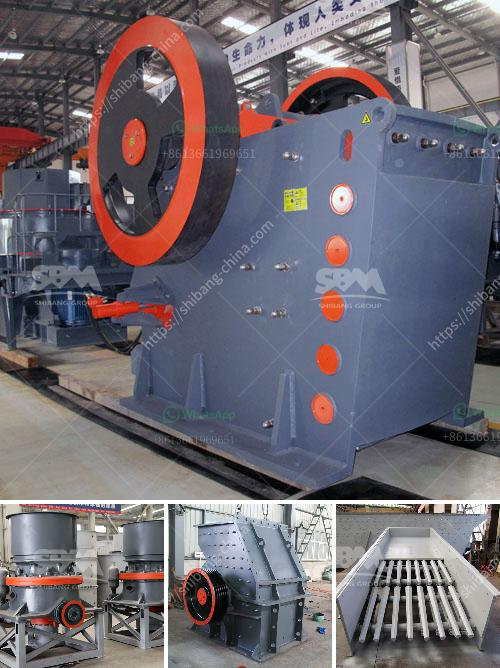

<h3>stone pickers machine in india</h3>
In India, agriculture forms the backbone of the economy, employing a significant population. However, farming can be a challenging task due to the presence of stones in fields. To mitigate this problem, innovative solutions have emerged, among which the stone pickers machine has garnered attention. This article explores the significance of stone pickers machines in Indian agriculture, their functionality, benefits, and their potential to revolutionize the farming landscape.

The stone pickers machine is a farm implement engineered to efficiently remove stones and other debris from agricultural land. It consists of a robust body fitted with contra-rotating drums, which effectively separate rocks from the soil. Equipped with adjustable speed settings, this machine is capable of efficiently removing stones, small rocks, and other solid foreign objects from the soil, leaving the field clear and prepared for cultivation.

The stone pickers machine has several advantages that make it vital in Indian agriculture. Firstly, it significantly reduces labor-intensive practices traditionally employed to manually remove stones, saving time and manpower. Secondly, it helps prevent damage to farming machinery, such as plows and harvesters, which can be hindered or broken by stones. Additionally, this machine minimizes yield losses caused by rocks interfering with sowing and harvesting operations. Moreover, removing stones from the soil enhances soil quality, leading to improved crop productivity. Lastly, it aids in reducing the dependence on chemical fertilizers since its regular use assists in maintaining soil fertility.

The use of stone pickers machines in India has the potential to revolutionize the country's farming landscape. By effectively removing stones from fields, farmers can avert potential crop damage or yield losses caused by rocky terrains. With more efficient land preparation, farmers can cultivate larger areas in less time, subsequently increasing productivity and overall agricultural output. Additionally, the time saved on labor-intensive stone removal tasks can be utilized for other crucial farming activities, allowing farmers to focus on higher-value activities, thereby augmenting their income potential.

The stone pickers machine has emerged as a game-changer in Indian agriculture, addressing the long-standing issue of rocky fields. With its ability to efficiently remove stones and save labor, this machine stands at the forefront of technological advancements transforming the farming sector. From saving time and reducing yield losses to enhancing soil quality and increasing productivity, farmers can harness the benefits offered by the stone pickers machine to unlock their potential and contribute to economic growth. As the technology advances further, it is expected to witness wider adoption and integration in Indian farming practices, revolutionizing the industry as a whole.
<h3>Contact us</h3><ul><li><strong>Whatsapp:&nbsp;<a href="https://wa.me/8613661969651">+8613661969651</a></strong></li><li><a href="https://swt.shibang-china.com/?git&amp;zhl&amp;stone pickers machine in india"><strong>Online Service(chat now)</strong></a></li></ul><h3>Related</h3><ul><li><a href='2nd hand old mining process plant.md'>2nd hand old mining process plant</a></li><li><a href='granite crushing line.md'>granite crushing line</a></li><li><a href='stone crusher machine manufacturer in ethiopia.md'>stone crusher machine manufacturer in ethiopia</a></li><li><a href='quartz marble making machine.md'>quartz marble making machine</a></li><li><a href='hammer crusher clinker.md'>hammer crusher clinker</a></li></ul>