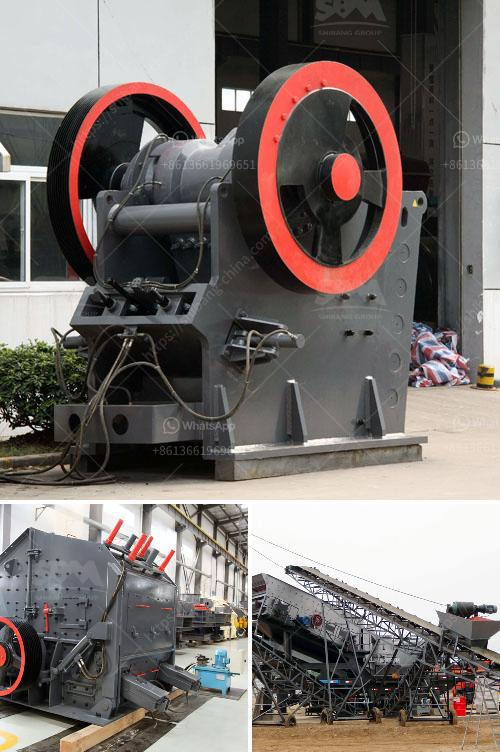

<h3>stone powder machine</h3>
Stone powder machine, also known as stone miller machine, is a type of stone processing machinery that utilizes the principles of mechanical force and sheer stress to grind various types of stones into powder. It is a vital tool for industries that require powdered stones for different production processes.

The stone powder machine consists of a rotor that revolves at high speed, an abrasive body, and a gap adjusting device. The stones are fed into the machine through a hopper and are ground between the rotor and abrasive body. As a result, the stones are transformed into fine particles or powder.

This machine is mainly used for processing various types of stones, such as limestone, granite, marble, and more. It is widely used in industries such as construction, mining, chemical, cement, and metallurgy.

There are several advantages to using a stone powder machine. First and foremost, it provides a cost-effective solution for companies that need powdered stones. Instead of purchasing pre-ground stones, companies can produce their own powdered stones on-site, reducing costs in the long run.

Furthermore, the stone powder machine offers a more precise control over the particle size of the stones. The gap adjusting device allows for customization, ensuring that the stones are ground to the desired consistency.

Additionally, using a stone powder machine reduces the amount of waste generated during the grinding process. The machine operates in a closed system, preventing the dispersal of stone dust into the surrounding environment.

In conclusion, the stone powder machine is a versatile and valuable tool for industries that require powdered stones. It offers cost savings, precise control over particle size, and reduces waste. Investing in a stone powder machine can improve efficiency and productivity in various applications.
<h3>Contact us</h3><ul><li><strong>Whatsapp:&nbsp;<a href="https://wa.me/8613661969651">+8613661969651</a></strong></li><li><a href="https://swt.shibang-china.com/?git&amp;zhl&amp;stone powder machine"><strong>Online Service(chat now)</strong></a></li></ul><h3>Related</h3><ul><li><a href='mtw series trapezium mill.md'>mtw series trapezium mill</a></li><li><a href='crushed aggregates supplier in negros.md'>crushed aggregates supplier in negros</a></li><li><a href='tanzania processing plant cost.md'>tanzania processing plant cost</a></li><li><a href='mini mobile crusher.md'>mini mobile crusher</a></li><li><a href='roller mill diagram.md'>roller mill diagram</a></li></ul>