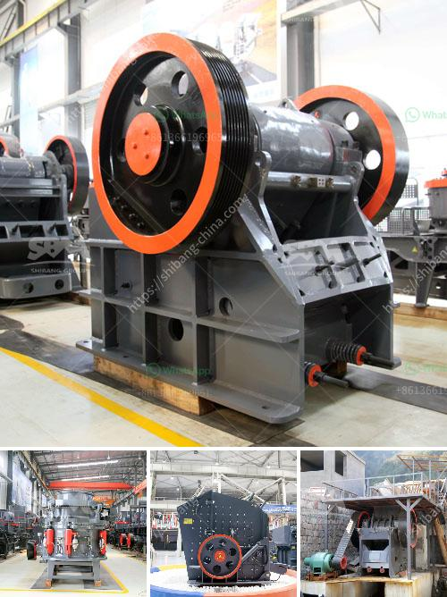

<h3>stone powder milling small machine</h3>
In the world of industrial machinery, milling machines play a crucial role in the manufacturing process. They are used to remove excess material from raw materials, resulting in a desired shape or size. One type of milling machine that has gained significant popularity in recent times is the stone powder milling small machine.

Stone powder milling small machines are compact, versatile, and highly efficient equipment designed for small-scale businesses. With their ability to process various materials into fine powders, they have become an indispensable tool for industries such as mining, construction, ceramics, and more.

The primary function of these machines is to convert raw materials, such as stones or minerals, into fine particles or powders. This process is achieved by forcibly crushing the materials between two solid surfaces. The resulting powders can then be used for various purposes, such as construction materials, ingredients in cosmetics, or even in the pharmaceutical industry.

One of the key advantages of stone powder milling small machines is their compact size. Unlike larger industrial milling machines, these small-scale machines can easily fit into limited space. This feature is particularly beneficial for small-scale businesses with limited workspace or those operating in remote areas.

Furthermore, stone powder milling small machines are highly efficient and energy-saving. They incorporate advanced technologies, such as high-pressure grinding rollers or centrifugal force, which ensures maximum productivity with minimal energy consumption. This is particularly crucial for small businesses as it helps to reduce operational costs and increase overall profitability.

Another significant advantage of stone powder milling small machines is their versatility. These machines are designed to handle a wide range of materials, including limestone, marble, calcite, dolomite, and many more. This versatility allows businesses to diversify their production capabilities and cater to various customer demands.

Moreover, stone powder milling small machines are relatively easy to operate and maintain. They are equipped with user-friendly interfaces and controls, making them accessible to operators with minimal training. Additionally, maintenance requirements are minimal, ensuring minimal downtime and uninterrupted production.

Despite their compact size, stone powder milling small machines deliver exceptional performance. They can process a substantial amount of material within a short period, ensuring quick turnaround times and meeting tight production schedules. This efficiency is crucial for small businesses looking to maximize their output while minimizing operational costs.

In conclusion, stone powder milling small machines have revolutionized small-scale businesses in multiple industries. With their compact size, energy-efficient operation, versatility, and exceptional performance, they have become the perfect solution for those looking to process materials into fine powders. These machines provide small businesses with the means to diversify their production capabilities, reduce operational costs, and increase overall profitability. Therefore, for any small-scale business involved in materials processing, investing in a stone powder milling small machine is a prudent decision.
<h3>Contact us</h3><ul><li><strong>Whatsapp:&nbsp;<a href="https://wa.me/8613661969651">+8613661969651</a></strong></li><li><a href="https://swt.shibang-china.com/?git&amp;zhl&amp;stone powder milling small machine"><strong>Online Service(chat now)</strong></a></li></ul><h3>Related</h3><ul><li><a href='grinding mill for sale servants.md'>grinding mill for sale servants</a></li><li><a href='gypsum mining crusher dubai.md'>gypsum mining crusher dubai</a></li><li><a href='functions of a mobile crushing plant.md'>functions of a mobile crushing plant</a></li><li><a href='price a stone crusher in peru.md'>price a stone crusher in peru</a></li><li><a href='hammer mill in china.md'>hammer mill in china</a></li></ul>