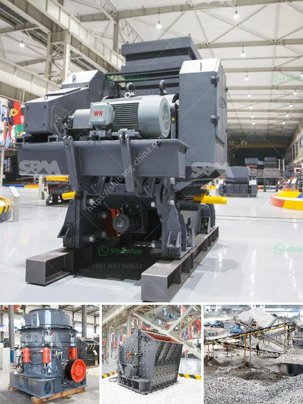

<h3>stone quarries crusher in uganda</h3>
Stone quarries are a vital part of the construction industry in Uganda. The majority of building materials like sand, aggregates, stones, and bricks are obtained from these quarries. One of the notable stone quarrying regions is Mukono, which is located in the eastern part of Uganda. It is estimated that over 80% of Mukono's stone quarries are owned by a foreign company known as Tororo Stone Limited.

Most of the individuals working in these quarries earn low wages and are often subjected to poor working conditions. However, the stone quarrying is not only a source of income but also a significant contributor to Uganda's economic growth. Stone crushers are used to break rocks into small fragments to be used in building or other purposes.

The machines come in different sizes and capacities. Most of the machines are quite heavy, weighing over 10,000 pounds. A stone crusher uses force to crush rocks into small pieces, which fall into a larger container for further processing. These machines are used in a variety of construction projects, including laying roads, building bridges, and tunnels.

The demand for crushed stones is expected to increase with ongoing construction projects in Uganda. The government has invested heavily in infrastructure development, leading to a surge in the stone quarrying sector. Additionally, the growing population and urbanization have also increased the demand for building materials.

However, stone crushing is not without its risks. The nature of the work exposes workers to various hazards, including dust, noise, and flying debris. Without proper safety measures and equipment, workers can suffer from respiratory problems, hearing loss, and other health issues.

To mitigate these risks, it is important for the government and stone quarry owners to prioritize the safety and welfare of their workers. This includes enforcing safety regulations, providing protective gear, and ensuring regular health check-ups.

In conclusion, stone quarries in Uganda play a vital role in the construction industry and contribute to the country's economic growth. However, it is essential to address the concerns and risks faced by workers in these quarries. By prioritizing safety and implementing proper regulations, the stone quarrying sector can continue to thrive while protecting the welfare of its workers.
<h3>Contact us</h3><ul><li><strong>Whatsapp:&nbsp;<a href="https://wa.me/8613661969651">+8613661969651</a></strong></li><li><a href="https://swt.shibang-china.com/?git&amp;zhl&amp;stone quarries crusher in uganda"><strong>Online Service(chat now)</strong></a></li></ul><h3>Related</h3><ul><li><a href='quarry crusher in kenya.md'>quarry crusher in kenya</a></li><li><a href='how much is a stone crusher.md'>how much is a stone crusher</a></li><li><a href='mtw series trapezium mill.md'>mtw series trapezium mill</a></li><li><a href='crusher gravel crusher gravel crusher price.md'>crusher gravel crusher gravel crusher price</a></li><li><a href='sand screeding machine prices.md'>sand screeding machine prices</a></li></ul>