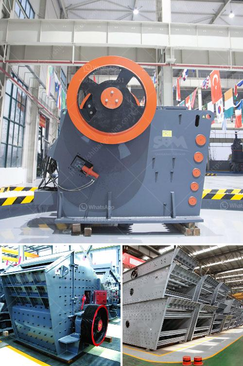

<h3>stone quarries cursher south africa</h3>
Stone Quarrying Process Line is widely used as sand making line, rock crushing line, stone crushing plant. Ore dressing line, aggregate production line, construction waste recycling plant and so on. Stone Quarrying Process Line is designed according to customer’s different requirements of the stones and the output size. We provide the whole set of crushing and screening line, which is large scale and high efficiency. According to the requirements of different crushing processes, it can be formed into "first crushing and second sieve" or "first sieve and then crushing". The crushing plant can be combined into coarse crushing system and fine crushing system according to customers’ actual needs, it can also be combined into three stages: coarse crushing, crushing and fine crushing. Moreover, it can also work individually and its layout has great flexibility.

 Crusher South Africa crusher south africa, Xuanshi Machinery, founded in 2002, is a professional mining crushing machine manufacturer in China. Through our continuing efforts, 8 years of experience and a dedicated staff, we are able to offer a wide variety of products, including stone crushers, sand machines, grinding mills, sand and gravel equipment, mineral processing equipment, and more.

As a result, there are many types and models of the machines available in the market. In addition, we can customize all kinds of crushers and other machines according to your specific requirements. With the assistance of our detailed product knowledge, we can offer you tailored solutions that can help you to complete your production objectives in the most efficient and economical manner.

Crusher South Africa is committed to producing and selling the best mining machinery and equipment in the mining industry. Stone Quarrying Process Line has already appeared in the market and been exported to many countries and regions, such as Nigeria, Tanzania, Kenya, South Africa, Mexico, New Zealand, Indonesia, Malaysia, Nepal, etc. If you want to get more detailed product information and prices, please click the online chat button or send an email to us, we will promptly reply to you!
<h3>Contact us</h3><ul><li><strong>Whatsapp:&nbsp;<a href="https://wa.me/8613661969651">+8613661969651</a></strong></li><li><a href="https://swt.shibang-china.com/?git&amp;zhl&amp;stone quarries cursher south africa"><strong>Online Service(chat now)</strong></a></li></ul><h3>Related</h3><ul><li><a href='jaw crusher materials.md'>jaw crusher materials</a></li><li><a href='dolomite rock processing plan in ethiopia.md'>dolomite rock processing plan in ethiopia</a></li><li><a href='sale of stone crushers.md'>sale of stone crushers</a></li><li><a href='small portable crusher for laboratory purpose in india.md'>small portable crusher for laboratory purpose in india</a></li><li><a href='calculation of cement ball mill capacity.md'>calculation of cement ball mill capacity</a></li></ul>