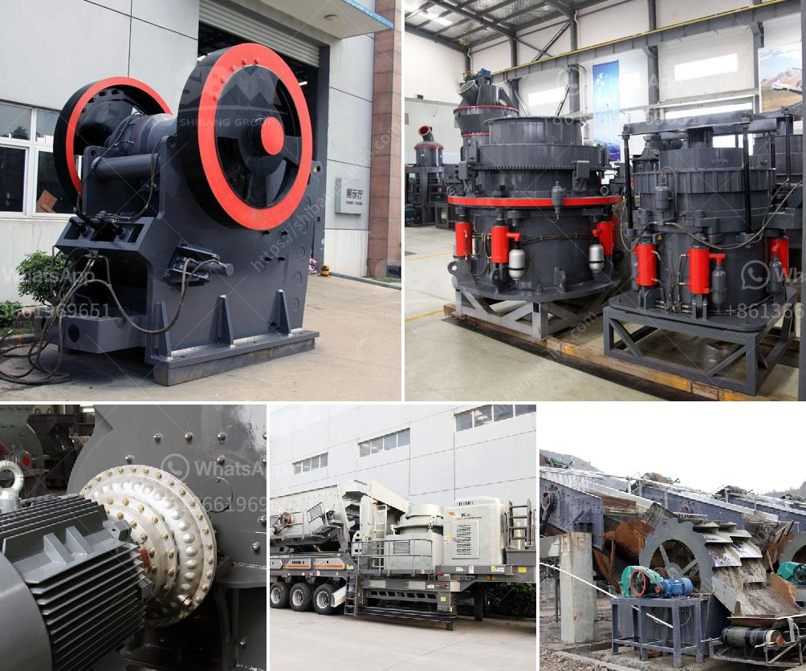

<h3>stone quarry equipment germany</h3>
Germany is known for its high-quality products in many industries, including quarrying. Stone quarry equipment has a vital role in German economy development. As a supplier of natural resources, raw materials, and a major player in the paving and construction industry, Germany represents a significant market for stone quarry equipment.

Germany imports a substantial amount of stone, primarily natural stones such as granite, marble, and limestone. The demand for these materials in the construction industry is continuously on the rise due to urbanization and infrastructure development. Consequently, the need for efficient stone quarry equipment to extract, cut, and process these stones becomes crucial.

German companies specialize in manufacturing and supplying stone quarry equipment to meet the demands of the market. They offer a wide range of machinery that includes crushers, wheel loaders, excavators, dozers, dump trucks, and other equipment used in stone quarrying operations. These machines are designed to extract stones from the ground and process them into various sizes for different applications.

One of the companies leading the stone quarry equipment manufacturing in Germany is Liebherr. With decades of experience in the construction and quarrying industry, Liebherr produces state-of-the-art equipment known for its reliability, productivity, and safety features. Their range of machines caters to both small and large-scale quarrying operations, allowing businesses to find the right equipment that suits their needs.

In addition to manufacturing equipment, German companies also provide after-sales services, including maintenance, spare part supply, and technical support. This ensures that the stone quarry equipment operates smoothly and efficiently, minimizing downtime and maximizing productivity.

Moreover, the stone quarry equipment manufactured in Germany complies with strict quality and environmental standards. German manufacturers prioritize sustainable and eco-friendly practices, ensuring that their equipment is energy-efficient and meets the required emissions standards.

In conclusion, stone quarry equipment plays a vital role in Germany's construction and infrastructure development. German manufacturers offer a wide range of high-quality machinery that meets the demands of the market while adhering to strict quality and environmental standards. These machines enable efficient stone extraction and processing, contributing to the growth of the industry and the economy as a whole.
<h3>Contact us</h3><ul><li><strong>Whatsapp:&nbsp;<a href="https://wa.me/8613661969651">+8613661969651</a></strong></li><li><a href="https://swt.shibang-china.com/?git&amp;zhl&amp;stone quarry equipment germany"><strong>Online Service(chat now)</strong></a></li></ul><h3>Related</h3><ul><li><a href='non magnetic vibrating screen.md'>non magnetic vibrating screen</a></li><li><a href='construction of roller mill.md'>construction of roller mill</a></li><li><a href='jaw crusher start up procedure.md'>jaw crusher start up procedure</a></li><li><a href='crushing plant company.md'>crushing plant company</a></li><li><a href='copper crusher exporter in south africa.md'>copper crusher exporter in south africa</a></li></ul>