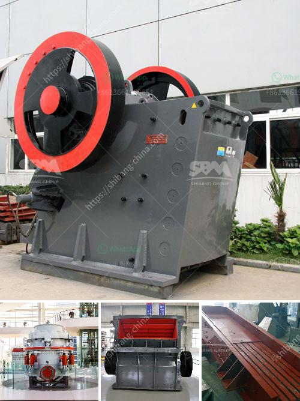

<h3>stone quarrying machines in dubai</h3>
Dubai is known for its impressive skyline and extravagant lifestyle, but beneath the glamorous façade, there lies a thriving quarrying industry. Quarrying refers to the process of extracting stone for various construction purposes, and it plays a crucial role in Dubai's rapid development.

Stone quarrying machines in Dubai have made it possible for many of the city's ambitious construction projects to be completed on time. These highly efficient machines have transformed the quarrying process, allowing companies to increase productivity and maximize profits. Let's delve into the world of stone quarrying machines and explore their importance in Dubai's construction industry.

One of the primary machines used in the stone quarrying process is the excavator. This heavy-duty machine is equipped with a bucket that can remove large quantities of soil and rocks from the quarry site. With its powerful hydraulic system, an excavator can dig deep into the earth, exposing the valuable stone deposits hidden beneath the surface. Excavators also come in different sizes, allowing companies to select the most suitable machine for their specific quarrying needs.

Once the stone deposits have been exposed, machines such as rock drills and blasting equipment are used to break down the rocks into smaller, manageable pieces. These machines employ various techniques to ensure a controlled and efficient process. Rock drills are used to create precise holes in the rocks, while blasting equipment uses explosives to shatter the rock formations. This combination of drilling and blasting techniques accelerates the stone extraction process and saves both time and labor.

After the rocks have been broken down, the next step is to transport them from the quarry site to the stone processing facility. Quarry dump trucks are commonly used for this purpose. These enormous trucks are designed to carry heavy loads of stones over long distances. Their robust construction and powerful engines make them ideal for navigating rough terrain and ensuring a smooth transportation process.

Stone quarrying machines in Dubai have also seen advancements in technology. Computerized systems are now integrated into these machines, enabling operators to control and monitor various functions remotely. This technology not only enhances safety but also allows for precise control of the machines, resulting in a more efficient stone extraction process.

In addition to increased productivity, the use of stone quarrying machines in Dubai also promotes sustainability. Advanced equipment is designed to minimize dust emissions and noise pollution, ensuring a more environmentally friendly operation. Furthermore, the efficient extraction process reduces the amount of waste generated, making it easier to rehabilitate the quarried areas once the operation is complete.

In conclusion, stone quarrying machines in Dubai have revolutionized the construction industry in the city. These machines have proven to be a valuable asset, allowing companies to maximize productivity and profit. With continuous advancements in technology, the future of stone quarrying machines in Dubai looks promising. As long as the demand for construction materials remains high, these machines will continue to play a crucial role in the city's development, contributing to its impressive skyline and ongoing growth.
<h3>Contact us</h3><ul><li><strong>Whatsapp:&nbsp;<a href="https://wa.me/8613661969651">+8613661969651</a></strong></li><li><a href="https://swt.shibang-china.com/?git&amp;zhl&amp;stone quarrying machines in dubai"><strong>Online Service(chat now)</strong></a></li></ul><h3>Related</h3><ul><li><a href='crushing pe jaw crusher.md'>crushing pe jaw crusher</a></li><li><a href='processing of quartz crusher.md'>processing of quartz crusher</a></li><li><a href='crushed gravel supplier in negros oriental.md'>crushed gravel supplier in negros oriental</a></li><li><a href='ball mills china.md'>ball mills china</a></li><li><a href='hammer mill grinder for sale in dubai.md'>hammer mill grinder for sale in dubai</a></li></ul>