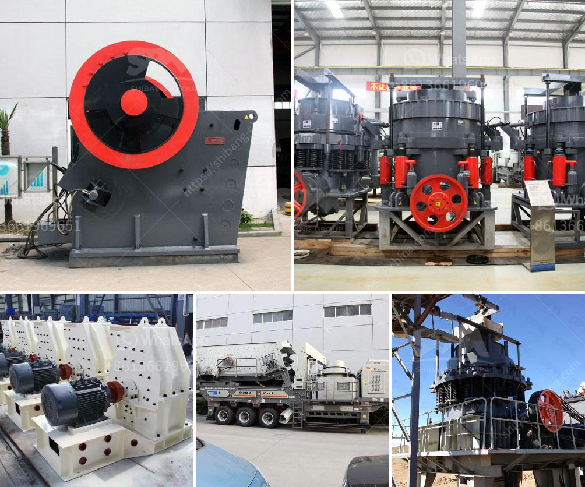

<h3>stone quarrying stone crusher</h3>
Stone quarrying is one of the major practices carried out in the world by the construction industry. In Kenya and specifically in Mandera County area, stone quarrying industry has grown rapidly in recent years. Objective: This study thus aims at examining the impact that stone quarrying has had on the environment and the livelihood of the communities in Mandera County, Kenya. Methodology: Both qualitative and quantitative approaches were used for data collections and analysis. Results: The study found that stone quarrying has significantly contributed to the incomes of the stone crushers, local communities, and the national economy. Conclusion: Prospects of stone crusher industry in Mandera County are associated with the poor infrastructure, high unemployment, and trade imbalances among individuals involved in the stone quarrying business. 

Stone quarrying is a form of land use method concerned with the extraction of non-fuel and non-metal minerals from rocks. Using the qualitative model, the paper interrogates the impact of stone quarrying on the livelihoods of the workers and provides critical insights into the impacts of stone quarrying on the environment. Stone quarrying and crushing involves a variety of processes that create potential for environmental impact, especially dust and noise pollution. 

Stone crusher is a machine designed to reduce large rocks into smaller rocks, gravel, or rock dust. Stone crusher is a machine designed to reduce large rocks into smaller rocks, gravel or rock dust. Crushers may be used to reduce the size, or change the form, of waste materials so they can be more easily disposed of or recycled or to reduce the size of a solid mix of raw materials, so that pieces of different composition can be differentiated. 

The study revealed that stone quarrying has brought both economic and social benefits to the local communities in Mandera County. For instance, the income generation aspect of stone quarrying, which employs local people, has increased over the years. This has had a positive impact on poverty alleviation, and the overall development of the area. Additionally, stone quarrying has provided lucrative opportunities for entrepreneurs and investors who wish to venture into the industry. As a result, the stone crusher industry in Mandera County provides employment opportunities, generates useful income, and addresses poverty in the local area.

However, despite these positive impacts, the stone quarrying industry also brings with it negative impacts to the environment. For instance, large quantities of wastes are generated during the extraction and crushing process. The accumulation of these wastes leads to environmental degradation such as soil erosion, formation of sinkholes, and loss of biodiversity. Additionally, dust and noise pollution are common challenges posed by the stone quarrying industry. These environmental impacts can have long-term consequences on the ecological balance of the area. 

In conclusion, stone quarrying and stone crushing industry are associated with the production of construction aggregates, which are extensively used in building and infrastructure projects. Therefore, the stone quarrying industry and associated stone crushing industry are considered vital sectors in the Mandera County and Kenya as a whole. 

Efforts should be made to regulate the activities of stone quarrying and stone crushing units especially in terms of water consumption, emissions from the crushers and dust generated during the crushing process. Further research should be conducted to explore the potential for utilizing locally available rock dust and also to study the impacts of such dust on the environment and climate change. This way, stone quarrying and crushing activities could be made more sustainable, providing long-term benefits to the local community and the environment.
<h3>Contact us</h3><ul><li><strong>Whatsapp:&nbsp;<a href="https://wa.me/8613661969651">+8613661969651</a></strong></li><li><a href="https://swt.shibang-china.com/?git&amp;zhl&amp;stone quarrying stone crusher"><strong>Online Service(chat now)</strong></a></li></ul><h3>Related</h3><ul><li><a href='sell stone crusher.md'>sell stone crusher</a></li><li><a href='ball mill manufacturers coconut shell.md'>ball mill manufacturers coconut shell</a></li><li><a href='raymond mill manufactrer in udaipur.md'>raymond mill manufactrer in udaipur</a></li><li><a href='complete stone crusher set.md'>complete stone crusher set</a></li><li><a href='crusher machine factories in coimbatore.md'>crusher machine factories in coimbatore</a></li></ul>