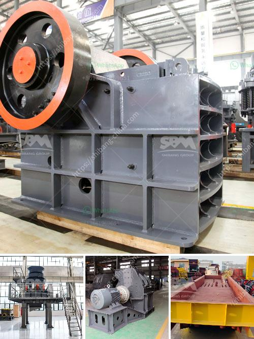

<h3>stone sand making machine in nignia</h3>
Stone sand making machine, also known as sand making machine, is mainly used to crush and reshape hard or medium-hard materials like ore, concrete, etc. With the rapid development of construction industry, various types of equipment are required for processing different materials. Stone sand making machine has become one of the main equipment in this field.

In recent years, the government has vigorously promoted the infrastructure construction, which has brought new opportunities for the development of stone sand making machine industry in India. The stone sand making machine produced by Indian manufacturers is not only suitable for the processing of soft materials, but also has certain advantages in processing hard materials.

Compared with traditional sand making equipment, the stone sand making machine in India has a higher crushing efficiency and processing capacity. The optimized design of the crushing cavity and rotor greatly improves the material throughput and crushing ratio. In addition, the stone sand making machine also has the advantages of low energy consumption, long service life of wearing parts, and convenient maintenance.

The stone sand making machine in India adopts advanced technology and high-quality raw materials. The key parts, like the rotor and the crushing cavity, are made of high-strength materials, which are not only wear-resistant but also have a longer service life. The unique air self-circulation system greatly reduces dust pollution, making the working environment cleaner and more environmentally friendly.

In terms of operation and maintenance, stone sand making machine in India is also very convenient. It is equipped with a hydraulic device, which can quickly adjust the discharge port and clear the chamber, greatly reducing downtime. The maintenance of wearing parts is also simple. The replacement of wearing parts can be completed through the side or top opening, without disassembling the machine, which saves time and effort.

In addition to the advantages mentioned above, the stone sand making machine in India also has a wide range of applications. It can not only be used for processing sand and gravel aggregates, but also for crushing and shaping various rocks, ores, and concrete, which can meet the needs of different customers.

In conclusion, with the continuous advancement of infrastructure construction in India, the demand for sand making machine equipment is increasing. The stone sand making machine in India has made great contributions to the construction industry and has a broad market prospect. With its excellent performance, high efficiency, and convenient operation and maintenance, it will surely become the preferred equipment for processing sand and gravel aggregates in India.
<h3>Contact us</h3><ul><li><strong>Whatsapp:&nbsp;<a href="https://wa.me/8613661969651">+8613661969651</a></strong></li><li><a href="https://swt.shibang-china.com/?git&amp;zhl&amp;stone sand making machine in nignia"><strong>Online Service(chat now)</strong></a></li></ul><h3>Related</h3><ul><li><a href='small scale coal processing plant.md'>small scale coal processing plant</a></li><li><a href='model of raymound roller mill.md'>model of raymound roller mill</a></li><li><a href='manufacturer of barite in pakistan.md'>manufacturer of barite in pakistan</a></li><li><a href='rock crusher pulverizer.md'>rock crusher pulverizer</a></li><li><a href='rent a conveyor belts singapur.md'>rent a conveyor belts singapur</a></li></ul>