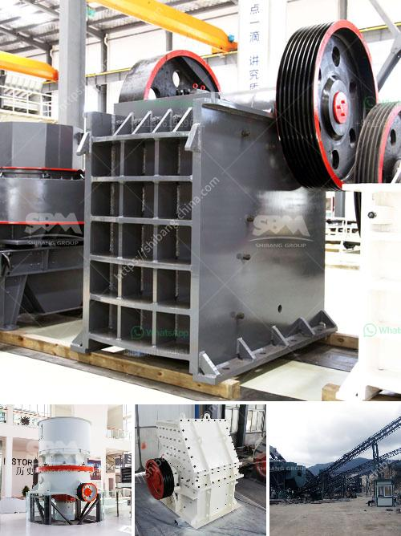

<h3>stone stone crusher machine malaysia</h3>
Stone crusher machine is a machine used to crush large stones into smaller stone sizes. The stone crusher machine works by using high pressure to break the stone into smaller sizes. This machine is widely used in processing stones in mining industries, construction, metallurgy, etc.

The machines come with a variety of specifications and manufacturers. The machines are usually made from strong heavy-duty materials to withstand the heavy workload. High-quality components are used in the manufacturing process to ensure the durability and efficiency of the machine.

Stone crusher machines are widely used in Malaysia as stone crushing equipment. The machines have unique features and advantages to ensure efficient operation and maintenance. These machines can be used in various industries, such as mining, building materials, metallurgy, highways, railways, water conservancy, and chemical industries.

The stone crusher machine Malaysia is widely used for crushing hard and mid-hard rocks and ores, such as iron ore, limestone, slag, coal, marble, bauxite, gold ore and other ores. It is also used for crushing stones in construction, road building, and mine industry.

Due to its ease of use and maintenance, stone crusher machines are widely demanded in the Malaysian market. Companies that sell heavy-duty stone crushing machines rely on machinery importers and buyers all over Malaysia to supply these products.

Various types of stone crushers are available in the market, including jaw crushers, cone crushers, impact crushers, mobile crushers, and multiple types of stationary crushers. These different machines work in different ways and have their own advantages.

The demand for stone crusher machines in Malaysia will be driven by factors such as rising demand from the construction and mining industries and rapid urbanization. The growth of these industries will boost the demand for stone crushing equipment.

In conclusion, stone crushing machines are now used in various industries and are available in different sizes. Stone crushers are perfect for primary and secondary crushing operations. With the increase in the demand for stone crusher machines, the market is expected to grow significantly in the forecast period.
<h3>Contact us</h3><ul><li><strong>Whatsapp:&nbsp;<a href="https://wa.me/8613661969651">+8613661969651</a></strong></li><li><a href="https://swt.shibang-china.com/?git&amp;zhl&amp;stone stone crusher machine malaysia"><strong>Online Service(chat now)</strong></a></li></ul><h3>Related</h3><ul><li><a href='coal pulverizer crusher manufacturers.md'>coal pulverizer crusher manufacturers</a></li><li><a href='small scale aggregate crushing machine.md'>small scale aggregate crushing machine</a></li><li><a href='mets ball mill specification.md'>mets ball mill specification</a></li><li><a href='small profile format for crusher company.md'>small profile format for crusher company</a></li><li><a href='best jaw crusher for making stone.md'>best jaw crusher for making stone</a></li></ul>