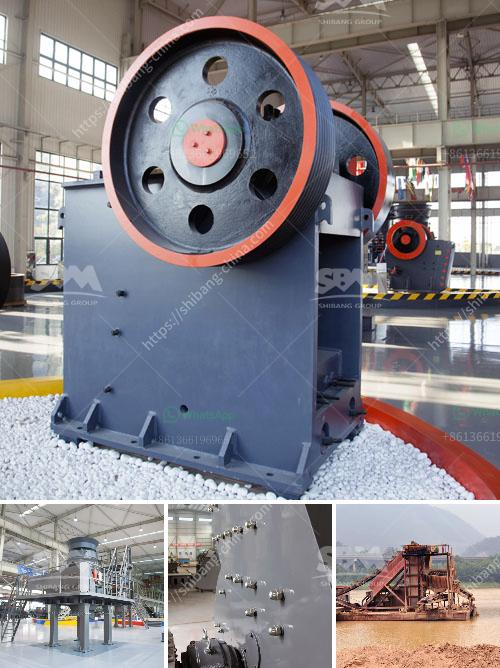

<h3>suoer fine mill grinder</h3>
Grinding is an essential process in various industries, ranging from mining and construction to pharmaceuticals and food processing. The quality and efficiency of the grinding process significantly influence the overall productivity and final product quality. As industries continue to demand higher precision grinding, the development of advanced grinding equipment, such as the Super Fine Mill Grinder, has become essential.

The Super Fine Mill Grinder is a cutting-edge grinding machine designed to achieve ultra-fine powder grinding. It offers exceptional grinding performance and precision, making it a preferred choice in industries that require high-quality ground materials. With its advanced features and capabilities, it has revolutionized the grinding process, enabling businesses to meet stringent specifications and achieve enhanced productivity.

One of the key attributes of the Super Fine Mill Grinder is its ability to produce ultra-fine particles. While traditional grinders have limitations regarding particle size reduction, this advanced grinder can achieve particle sizes as small as a few micrometers. The ultra-fine particles produced by the Super Fine Mill Grinder have a larger surface area, enabling them to dissolve quicker, mix more efficiently, and improve overall product performance.

Precision is another significant advantage offered by the Super Fine Mill Grinder. The construction of this grinder ensures strict control over the size and shape of the ground particles, resulting in consistent and uniform powder. This consistency is crucial, particularly in applications where even a slight deviation can lead to product rejection. The ability to achieve precise particle size distribution enhances the overall quality and performance of the final product.

The Super Fine Mill Grinder also stands out for its versatile applications. It can handle a wide range of materials, including minerals, chemicals, and metals, due to its robust construction. Whether it's grinding minerals for the production of ceramics or processing pharmaceutical ingredients for drug formulation, this grinder can adapt to various requirements and deliver exceptional results.

Additionally, the Super Fine Mill Grinder provides improved energy efficiency compared to traditional grinding equipment. Its innovative design minimizes energy consumption while maximizing grinding output, thereby reducing operational costs for businesses. Moreover, its low maintenance requirements ensure continuous operation without significant downtime or costly repairs.

Another noteworthy feature of the Super Fine Mill Grinder is its user-friendly design. The machine is engineered with simplicity in mind, making it easy to operate and maintain. Its intuitive interface and automated functions allow operators to achieve precise control over the grinding process with minimal effort or expertise. The steady and stable operation further contributes to user convenience and reduces the chances of errors or accidents.

In conclusion, the Super Fine Mill Grinder is a game-changer in the field of grinding technology. With its exceptional grinding performance, precision, versatility, energy efficiency, and user-friendly design, it offers numerous benefits to industries requiring ultra-fine powder production. The grinder's ability to achieve ultra-fine particles, consistent particle size distribution, and handle diverse materials make it an invaluable asset for businesses aiming to enhance their grinding processes and product quality. Embracing this cutting-edge technology enables companies to stay ahead of the competition and meet the evolving demands of the market.
<h3>Contact us</h3><ul><li><strong>Whatsapp:&nbsp;<a href="https://wa.me/8613661969651">+8613661969651</a></strong></li><li><a href="https://swt.shibang-china.com/?git&amp;zhl&amp;suoer fine mill grinder"><strong>Online Service(chat now)</strong></a></li></ul><h3>Related</h3><ul><li><a href='mineral pulverizer to 300 micron.md'>mineral pulverizer to 300 micron</a></li><li><a href='cost of the plant capacity of crusher.md'>cost of the plant capacity of crusher</a></li><li><a href='indonesia crushers of how much price.md'>indonesia crushers of how much price</a></li><li><a href='quartz production process.md'>quartz production process</a></li><li><a href='how to setup the manganese ore processing plant.md'>how to setup the manganese ore processing plant</a></li></ul>