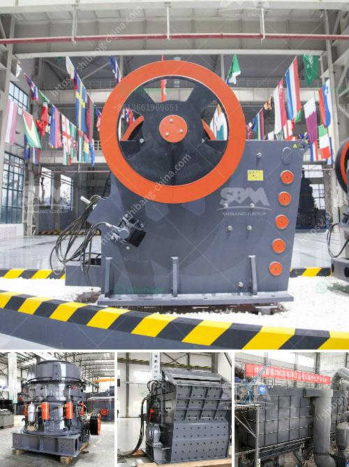

<h3>suplier jaw stone crusher nakayama in indonesia</h3>
Indonesia is a Southeast Asian country and has a rich natural wealth that is untapped when it comes to mining and construction industry. The opportunities in this sector are immense, and with the ever-increasing demand for materials such as stone, sand, and gravel, the need for efficient crushing equipment is increasing. One such reliable and trusted brand that has been providing high-quality jaw stone crushers in Indonesia is Nakayama.

Nakayama is a Japanese manufacturer with more than 100 years of experience in the heavy machinery industry. The company started its journey in 1908 as a wood-processing firm and later diversified into the construction machinery sector. Over the years, Nakayama has earned a reputation for producing innovative and reliable crushers, making it a go-to choice for many customers in Indonesia and worldwide.

The jaw stone crushers from Nakayama come with a variety of unique features that make them stand out in the market. One of the key features is the ability to crush different types of materials, including soft, medium, and hard stones. This versatility ensures that the crushers can be used in various applications, such as mining, quarrying, and recycling.

Nakayama's jaw crushers are also known for their high-quality construction, ensuring long-lasting performance. The machines are built using robust materials that can withstand the harshest working conditions. This durability reduces the chances of breakdowns and minimizes downtime, ultimately leading to increased productivity and profitability for the customers.

Another advantage of using Nakayama jaw stone crushers is their efficient operational performance. The machines are designed to deliver maximum crushing power while consuming less energy. This not only helps in reducing the operational costs but also makes it an environmentally friendly option.

In addition to their excellent performance, Nakayama provides outstanding after-sales support to its customers. The company has a dedicated team of trained technicians who provide prompt technical assistance, maintenance, and spare parts whenever needed. This ensures that customers can rely on the machines throughout their lifespan and maximize their return on investment.

Furthermore, Nakayama understands the importance of customization to meet specific customer requirements. The company offers a wide range of jaw stone crushers with different specifications and capacities. This flexibility allows customers to choose the crushers that best fit their needs, whether it's for small-scale projects or large-scale operations.

Nakayama has established a strong presence in Indonesia, and its jaw stone crushers can be found in various mining and construction sites across the country. The company works closely with local distributors and partners to ensure that its products are easily accessible to customers in different regions.

In conclusion, Nakayama is a trusted and reliable supplier of jaw stone crushers in Indonesia. With their long history in the industry, innovative features, efficient performance, and excellent after-sales support, they have become a popular choice among customers. Whether it's for mining, quarrying, or recycling, Nakayama's jaw crushers provide the perfect solution for crushing needs, contributing to the growth and development of Indonesia's mining and construction industry.
<h3>Contact us</h3><ul><li><strong>Whatsapp:&nbsp;<a href="https://wa.me/8613661969651">+8613661969651</a></strong></li><li><a href="https://swt.shibang-china.com/?git&amp;zhl&amp;suplier jaw stone crusher nakayama in indonesia"><strong>Online Service(chat now)</strong></a></li></ul><h3>Related</h3><ul><li><a href='for sale used mobile jaw crusher philippines.md'>for sale used mobile jaw crusher philippines</a></li><li><a href='ball mill for size reduct.md'>ball mill for size reduct</a></li><li><a href='marcasite ball mill.md'>marcasite ball mill</a></li><li><a href='manufacturing cost of 6mm rolling mill.md'>manufacturing cost of 6mm rolling mill</a></li><li><a href='gold milling equipment prices.md'>gold milling equipment prices</a></li></ul>