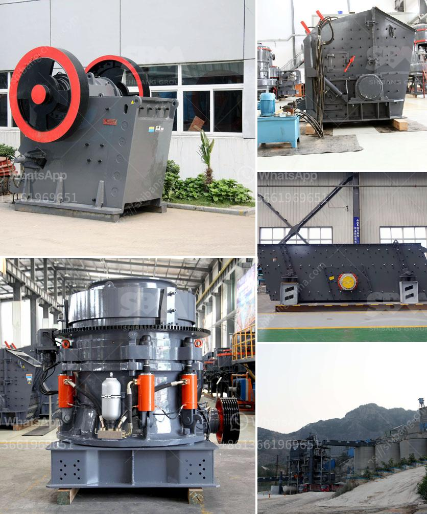

<h3>supplier for crusher</h3>
Choosing the right supplier for your crusher needs can be a crucial decision in the mining and quarrying industry. The supplier plays an important role in the overall success of your operation, as they provide essential equipment that will enable you to meet your production requirements efficiently. In this article, we will discuss the key factors you should consider when selecting a supplier for your crusher.

First and foremost, it is essential to assess the supplier's reputation. Look for a supplier with a solid track record in delivering high-quality crushers and related equipment. You can do this by researching their history, reading customer reviews, and evaluating their previous projects. A reputable supplier will have a strong reputation in the industry and will be known for providing reliable and durable crushers.

The next factor to consider is the supplier's range of products. A good supplier should offer a wide selection of crushers that cater to your specific needs. The crushers should be available in different sizes and configurations to suit the requirements of different applications. Additionally, they should offer a range of spare parts and provide maintenance services to ensure that your crusher continues to perform optimally in the long run.

Quality is another critical aspect that should not be overlooked. Look for a supplier that prioritizes quality in their products. The crushers should be built with robust materials and advanced technology to ensure durability, efficiency, and reliable performance. A high-quality crusher will help you maximize productivity and minimize downtime, ultimately improving your overall operations.

The supplier's after-sales support is also an essential factor to consider. A reliable supplier should provide comprehensive after-sales support, including installation, training, and maintenance services. They should have a team of experienced technicians who can assist you in setting up and operating the crusher. Regular maintenance and timely repairs are crucial to ensure that your crusher remains in optimal condition, so make sure the supplier offers these services.

Cost is understandably a significant consideration for any business. While it is important to find a supplier that offers competitive pricing, it is equally crucial to prioritize quality and reliability over cost alone. Cheaper crushers may seem appealing initially, but they often come with a higher risk of breakdowns and lower durability. Investing in a slightly more expensive but high-quality crusher will prove to be cost-effective in the long run, as it will require fewer repairs and replacements.

Finally, don't forget to consider the supplier's customer service. A supplier who values excellent customer service will be responsive, attentive, and readily available to address your concerns and queries. They should have a dedicated customer support team that can assist you promptly and provide timely solutions to any issues that may arise.

In conclusion, selecting the right supplier for your crusher is a critical decision that can significantly impact the success of your mining or quarrying operation. Consider factors such as reputation, range of products, quality, after-sales support, cost, and customer service when making your decision. By choosing a reliable and reputable supplier, you will ensure that you have a high-quality crusher that meets your production needs efficiently and reliably.
<h3>Contact us</h3><ul><li><strong>Whatsapp:&nbsp;<a href="https://wa.me/8613661969651">+8613661969651</a></strong></li><li><a href="https://swt.shibang-china.com/?git&amp;zhl&amp;supplier for crusher"><strong>Online Service(chat now)</strong></a></li></ul><h3>Related</h3><ul><li><a href='best cone crusher.md'>best cone crusher</a></li><li><a href='belt conveyor europe.md'>belt conveyor europe</a></li><li><a href='work of conveyor belts in peru.md'>work of conveyor belts in peru</a></li><li><a href='100 tph cobble crushing plant.md'>100 tph cobble crushing plant</a></li><li><a href='conveyor belts manufactures.md'>conveyor belts manufactures</a></li></ul>