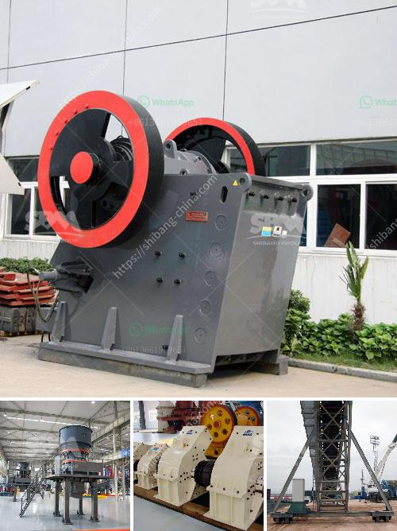

<h3>supplier of jaw crusher in south africa</h3>
A jaw crusher is usually the first part of a system of several crushing machines that break down the material into the desired shape and size. Large rocks are inserted into the mouth of the crushing chamber, where hydraulic pressure is applied to the material to crush it into a roughly uniform smaller size. There are essentially two types of jaw crushers: overhead eccentric and double-toggle. Each type works in a different way and serves different purposes. 

When it comes to South Africa, the supplier of the jaw crusher in the country is the best choice. There are various suppliers of jaw crushers in the country, but when choosing a supplier, you should consider various factors to choose the supplier that best meets your requirements. These factors include the credibility of the supplier, the quality and durability of the product, the after-sales service provided by the supplier, and the price of the product.

One of the most credible suppliers of jaw crushers in South Africa is Osborn. This supplier operates throughout South Africa and has its facilities in various locations across the country. Osborn offers excellent after-sales service, with efficient on-site training and regular site visits to assist customers in optimizing their equipment for maximum productivity and performance.

In terms of the quality and durability of the product, Osborn has built its reputation over many years by producing robust and reliable jaw crushers. The company uses high-quality materials and advanced manufacturing techniques to ensure that their crushers are built to last.

When it comes to the price, Osborn offers competitive pricing, ensuring that customers get value for their money. They also offer flexible payment options to make it easier for customers to purchase their equipment.

In conclusion, when looking for a supplier of jaw crushers in South Africa, it is important to consider factors such as credibility, quality, after-sales service, and price. Osborn is a reputable supplier in South Africa that checks all these boxes, making them the ideal choice for anyone in need of a jaw crusher.
<h3>Contact us</h3><ul><li><strong>Whatsapp:&nbsp;<a href="https://wa.me/8613661969651">+8613661969651</a></strong></li><li><a href="https://swt.shibang-china.com/?git&amp;zhl&amp;supplier of jaw crusher in south africa"><strong>Online Service(chat now)</strong></a></li></ul><h3>Related</h3><ul><li><a href='ore crushers benoni.md'>ore crushers benoni</a></li><li><a href='components of an impact mill.md'>components of an impact mill</a></li><li><a href='raymond mill roll asembley.md'>raymond mill roll asembley</a></li><li><a href='vibrating screens australia.md'>vibrating screens australia</a></li><li><a href='sewa stone crusher plant.md'>sewa stone crusher plant</a></li></ul>