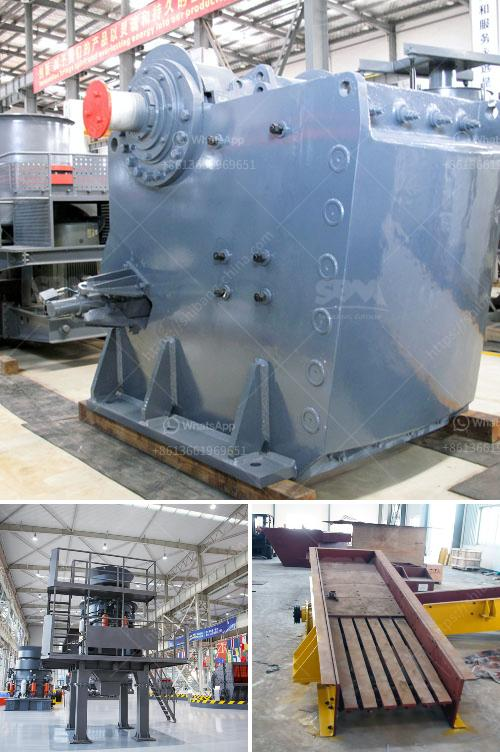

<h3>suppliers chrome mining equipment in zimbabwe</h3>
Supplier of the equipment used to mine chrome in Zimbabwe plays a vital role in the success of the mining operations. This equipment is essential for the extraction and processing of chrome ore, which is a key raw material used in various industries including stainless steel production.

There are several suppliers of chrome mining equipment in Zimbabwe, and they provide a wide range of machinery and equipment to enhance mining operations. These suppliers offer various types of equipment such as excavators, crushers, conveyors, and grinding mills. They also provide complete sets of equipment for specific mining processes, ensuring efficient and effective chrome extraction.

One of the reputable suppliers in Zimbabwe is committed to delivering quality chrome mining equipment that meets the industry's highest standards. Their equipment is known for its durability, reliability, and efficiency, ensuring high productivity and minimal downtime for mining operations. Furthermore, these suppliers also provide maintenance and technical support services, enabling smooth operations and reducing downtime caused by equipment breakdowns.

The suppliers of chrome mining equipment in Zimbabwe understand the unique challenges faced by the industry. They keep up to date with technological advancements and continually strive to provide the most advanced and efficient equipment to meet the ever-changing needs of the mining sector. This commitment to innovation helps mining companies optimize their operations and maximize their production.

Moreover, these suppliers also prioritize safety in the design and manufacturing of their equipment. They ensure that the machinery meets all industry safety guidelines, helping mining companies create a safe working environment for their employees.

In conclusion, the suppliers of chrome mining equipment in Zimbabwe play a crucial role in supporting the mining industry. Their high-quality and efficient equipment enable mining companies to extract and process chrome ore effectively. With their commitment to innovation and safety, these suppliers contribute to the growth and success of the chrome mining industry in Zimbabwe.
<h3>Contact us</h3><ul><li><strong>Whatsapp:&nbsp;<a href="https://wa.me/8613661969651">+8613661969651</a></strong></li><li><a href="https://swt.shibang-china.com/?git&amp;zhl&amp;suppliers chrome mining equipment in zimbabwe"><strong>Online Service(chat now)</strong></a></li></ul><h3>Related</h3><ul><li><a href='rock crusher machine manufacturer.md'>rock crusher machine manufacturer</a></li><li><a href='small rock gravel crushers.md'>small rock gravel crushers</a></li><li><a href='ball mill dry grinding 100mt hr capacity.md'>ball mill dry grinding 100mt hr capacity</a></li><li><a href='calculation of cement ball mill capacity.md'>calculation of cement ball mill capacity</a></li><li><a href='hammer mill how it works.md'>hammer mill how it works</a></li></ul>