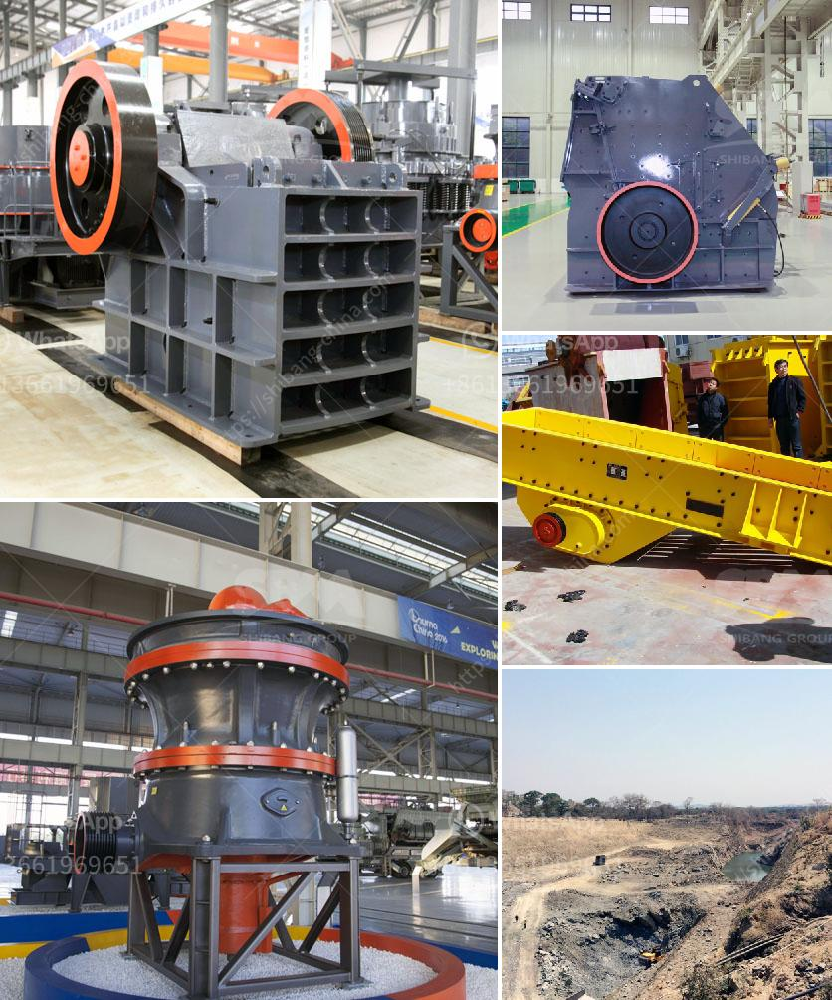

<h3>suppliers of conveyor belts in malaysia</h3>
Conveyor belts play a very crucial role in any industrial sector. They are used to transport heavy materials from one place to another efficiently, reducing human labor and enhancing productivity. Malaysia is one of the leading countries in terms of industrial sectors such as cooking oil, packaging, automotive, electronic, and many others, hence there is a high demand for conveyor belts in the country.

There are several suppliers of conveyor belts in Malaysia who offer different types of conveyor belts to various industries. They provide different types of conveyor belts like PVC conveyor belts, PU conveyor belts, silicone conveyor belts, rubber conveyor belts and stainless-steel conveyor belts. There is a wide range of sizes and designs offered by these suppliers that cater to the different needs of industries.

One of the reputable suppliers of conveyor belts in Malaysia is Misummer Sdn Bhd. They provide a wide range of conveyor belts suitable for various industries. Whether you need a conveyor belt for food processing, pharmaceutical, packaging, or automotive industries, they have a solution for you. Their conveyor belts are made from high-quality materials that ensure durability and long-lasting performance. They also offer customization options, where you can choose the size, design, and material to meet your specific requirements.

Another reliable supplier is Belt-Tech Engineering Supplies Sdn Bhd. They specialize in providing conveyor belts for the manufacturing and construction sectors. Their products come in various sizes and materials, allowing them to cater to different industries' needs. They focus on providing high-quality conveyor belts that are resistant to wear and tear, ensuring prolonged usage without compromising efficiency. Their experienced team of professionals assists in selecting the right conveyor belts for your industry, while also providing prompt installation and after-sales services.

For industries looking for a one-stop solution for all their conveyor belt needs, NSK Global Sdn Bhd is a reliable option. They offer a wide range of conveyor belts that cater to various industries such as food processing, packaging, mining, and agriculture. With their extensive experience, they are able to provide expert advice on the selection and customization of conveyor belts to suit specific industry requirements. They also offer maintenance and repair services to ensure smooth functioning and longevity of the conveyor belts.

In conclusion, conveyor belts are essential in Malaysia's industrial sector, allowing for efficient transportation of materials, reducing labor costs, and enhancing productivity. There are several reputable suppliers, such as Misummer Sdn Bhd, Belt-Tech Engineering Supplies Sdn Bhd, and NSK Global Sdn Bhd, that offer a wide range of conveyor belts suitable for various industries. These suppliers not only provide high-quality conveyor belts but also offer customization options, installation services, and maintenance support. So, if you are looking for reliable and efficient conveyor belt suppliers in Malaysia, these suppliers are worth considering.
<h3>Contact us</h3><ul><li><strong>Whatsapp:&nbsp;<a href="https://wa.me/8613661969651">+8613661969651</a></strong></li><li><a href="https://swt.shibang-china.com/?git&amp;zhl&amp;suppliers of conveyor belts in malaysia"><strong>Online Service(chat now)</strong></a></li></ul><h3>Related</h3><ul><li><a href='ultra fine calcium carbonate powder production equipment.md'>ultra fine calcium carbonate powder production equipment</a></li><li><a href='silica sand crusher suppliers toronto.md'>silica sand crusher suppliers toronto</a></li><li><a href='feasibility study of palm kernel crushing plant.md'>feasibility study of palm kernel crushing plant</a></li><li><a href='quarry dust in concrete sand making stone quarry.md'>quarry dust in concrete sand making stone quarry</a></li><li><a href='flow and grate type ball mill difference.md'>flow and grate type ball mill difference</a></li></ul>