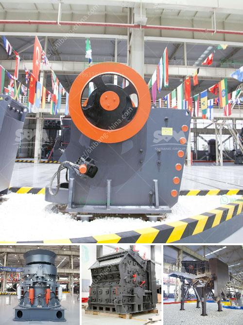

<h3>suppliers of crusher equipment in south africa</h3>
In recent years, South Africa has witnessed a significant growth in the infrastructure development sector. This has led to a greater demand for crusher equipment in the country. At present, there are many suppliers of crusher equipment in South Africa. The main reasons for the selection of these suppliers are product quality and reliability. It is also important for the suppliers to provide after-sales service and technical support to the customers.

One of the leading players in the South African market is Bell Equipment, a company that specializes in the manufacturing and supply of crushing equipment. Bell's range includes jaw crushers, cone crushers, impact crushers, and vertical shaft impact crushers. All Bell Equipment crushers are built to meet the highest quality standards and are backed by comprehensive after-sales service and technical support.

Another prominent supplier in South Africa is Pilot Crushtec, which offers a range of crushing and screening solutions. Pilot Crushtec's product portfolio includes jaw crushers, cone crushers, vertical shaft impact (VSI) crushers, impact crushers, screens, and conveyors. The company provides efficient and reliable solutions, ensuring maximum productivity and reduced downtime.

Metso, a global supplier of sustainable technology and services for the mining and construction industry, also has a strong presence in South Africa. Metso offers a wide range of crushing equipment, such as jaw crushers, cone crushers, impact crushers, and vertical shaft impact crushers. Metso's product portfolio covers the entire crushing process, from primary to tertiary stages.

Sandvik, a Swedish company specializing in mining and rock excavation equipment, is another supplier worth considering. Sandvik offers a comprehensive range of crushers, including jaw crushers, cone crushers, impact crushers, hammer crushers, and VSI crushers. Sandvik crushers are designed to provide high performance, reliability, and versatility, ensuring maximum productivity and reduced downtime.

These suppliers are not only known for providing high-quality crusher equipment but also for their exemplary after-sales service and technical support. In a market where customer satisfaction is paramount, these suppliers go the extra mile to ensure that their customers are well taken care of.

In conclusion, the suppliers of crusher equipment in South Africa play a significant role in the success of infrastructure development projects in the country. With their wide range of products, high-quality standards, and comprehensive after-sales service, these suppliers are ensuring that South Africa's crushing needs are met efficiently and effectively. Customers can rely on them for reliable and durable equipment that will contribute to increased productivity and reduced downtime.
<h3>Contact us</h3><ul><li><strong>Whatsapp:&nbsp;<a href="https://wa.me/8613661969651">+8613661969651</a></strong></li><li><a href="https://swt.shibang-china.com/?git&amp;zhl&amp;suppliers of crusher equipment in south africa"><strong>Online Service(chat now)</strong></a></li></ul><h3>Related</h3><ul><li><a href='stone crusher manufacturers in dhansura.md'>stone crusher manufacturers in dhansura</a></li><li><a href='portable stone crusher.md'>portable stone crusher</a></li><li><a href='how to make a vibrating screen for sale.md'>how to make a vibrating screen for sale</a></li><li><a href='crusher allis cone chalmers mod 500.md'>crusher allis cone chalmers mod 500</a></li><li><a href='coal crusher machine in zhengzhou henan china.md'>coal crusher machine in zhengzhou henan china</a></li></ul>