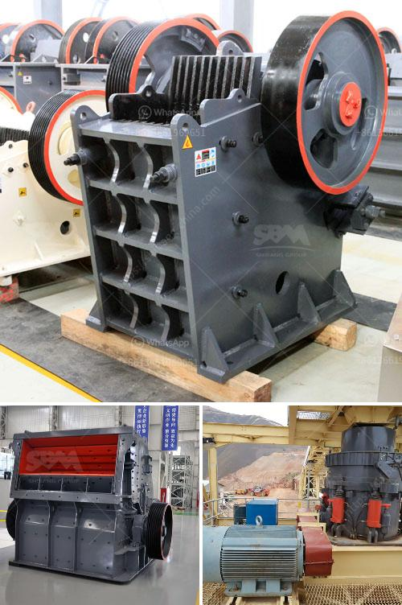

<h3>talc crusher processing plant</h3>
Talc is a common mineral found in metamorphic rocks. It is known for its softness and ability to absorb moisture. Talc is widely used in various industries, including cosmetics, ceramics, paints, and rubber. In order to meet the growing demand for talc, mining companies have established talc crusher processing plants.

A talc crusher processing plant grinds the talc blocks into powder form. This finely ground talc is used in various industries as a filler material, whitening agent, and lubricant. The processing plant crushes the mined talc rocks into smaller particles and then grinds them into powder form. It utilizes various crushers, such as jaw crusher, impact crusher, cone crusher, and VSI crusher, to perform the different crushing operations.

The talc crusher processing plant has a high production capacity and large crushing ratio. It can crush talc stones into fine powder size to satisfy different industry requirements. Besides, the processed talc powder is environmentally friendly and can be recycled, making it a sustainable option for industries.

Operating a talc crusher processing plant requires advanced technology and skilled manpower. The plant must adhere to strict safety guidelines and regulations to ensure the well-being of the workers and protect the environment. Additionally, proper maintenance and regular inspections are essential to ensure the smooth functioning of the processing plant.

Talc crusher processing plants play a significant role in meeting the demand for talc in various industries. They provide a valuable resource that is widely used in everyday products. These processing plants not only contribute to the economy but also adhere to sustainable practices, making them a responsible choice for talc production.

In conclusion, talc crusher processing plants are vital in the production of talc powder. With their ability to grind and crush talc rocks, these plants provide a valuable resource that is essential in various industries. They not only meet the growing demand for talc but also prioritize safety and sustainability.
<h3>Contact us</h3><ul><li><strong>Whatsapp:&nbsp;<a href="https://wa.me/8613661969651">+8613661969651</a></strong></li><li><a href="https://swt.shibang-china.com/?git&amp;zhl&amp;talc crusher processing plant"><strong>Online Service(chat now)</strong></a></li></ul><h3>Related</h3><ul><li><a href='project cost of 100 tpd opc cement plant.md'>project cost of 100 tpd opc cement plant</a></li><li><a href='non magnetic vibrating screen.md'>non magnetic vibrating screen</a></li><li><a href='quarry crusher rules.md'>quarry crusher rules</a></li><li><a href='mica processing technology and flow chart.md'>mica processing technology and flow chart</a></li><li><a href='coconut shell powder making machine grinding mill for sale.md'>coconut shell powder making machine grinding mill for sale</a></li></ul>