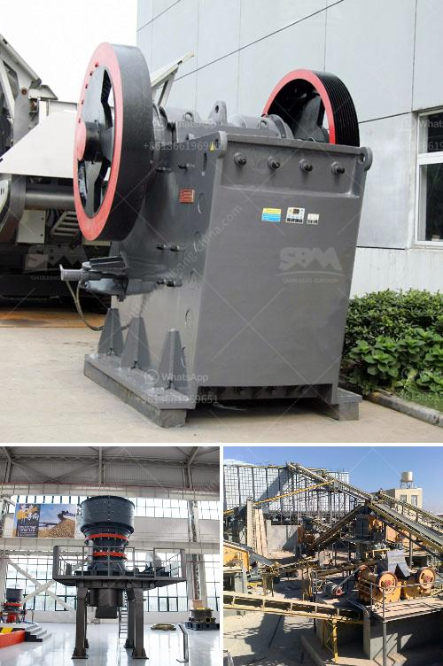

<h3>talc grinding mills usa</h3>
Talc is a naturally occurring mineral that is widely known for its softness and versatility. It is commonly used in various industries, including paper, ceramics, paint, and cosmetics, due to its unique properties. To meet the growing demand for talc, grinding mills in the USA play a crucial role in the processing of this mineral.

Talc grinding mills in the USA are designed to achieve the desired particle size and consistency of the final product. The mills consist of a rotating cylindrical drum that contains grinding media, such as balls or rods, which cause the ore to break down into fine particles. As the drum rotates, the media cascade and grind the talc particles, resulting in a powder of the desired size.

One of the key advantages of talc grinding mills in the USA is their ability to produce a high-quality product with a narrow particle size distribution. This is crucial for industries that require consistent and precise formulations. For example, in the cosmetics industry, talc is used as an ingredient in powders, foundations, and other products. The particle size of talc affects its texture, smoothness, and absorption capabilities. By using grinding mills, manufacturers can ensure that their talc products meet the desired specifications.

Another benefit of talc grinding mills in the USA is their efficiency in processing large quantities of ore. These mills are designed to handle high-capacity loads and can grind talc to the desired fineness in a relatively short time. This allows manufacturers to optimize their production processes and meet the demand for talc in a timely manner.

Furthermore, talc grinding mills in the USA are built with advanced technology to maximize energy efficiency and minimize environmental impact. Many mills are equipped with air classifiers, which separate the fine talc particles from the coarse ones. This not only improves the quality of the final product but also reduces the energy consumption of the grinding process.

In recent years, there has been an increased emphasis on sustainability and responsible manufacturing. Talc grinding mills in the USA are no exception. Many manufacturers have adopted environmentally friendly practices, such as using renewable energy sources and minimizing the use of water and chemicals in the production process. This ensures that the talc grinding industry in the USA remains sustainable and environmentally conscious.

In conclusion, talc grinding mills in the USA are essential in the processing of talc, a versatile mineral with numerous applications. These mills enable manufacturers to produce high-quality talc powder with a consistent particle size. They are efficient, capable, and environmentally friendly. As the demand for talc continues to grow, the talc grinding industry in the USA is poised to meet the needs of various industries and contribute to their success.
<h3>Contact us</h3><ul><li><strong>Whatsapp:&nbsp;<a href="https://wa.me/8613661969651">+8613661969651</a></strong></li><li><a href="https://swt.shibang-china.com/?git&amp;zhl&amp;talc grinding mills usa"><strong>Online Service(chat now)</strong></a></li></ul><h3>Related</h3><ul><li><a href='quartz grit making machine.md'>quartz grit making machine</a></li><li><a href='used cement clinker grinding plant.md'>used cement clinker grinding plant</a></li><li><a href='gold refining and essay report equipment.md'>gold refining and essay report equipment</a></li><li><a href='belt conveyor calculation sheet.md'>belt conveyor calculation sheet</a></li><li><a href='mtw series trapezium mill.md'>mtw series trapezium mill</a></li></ul>