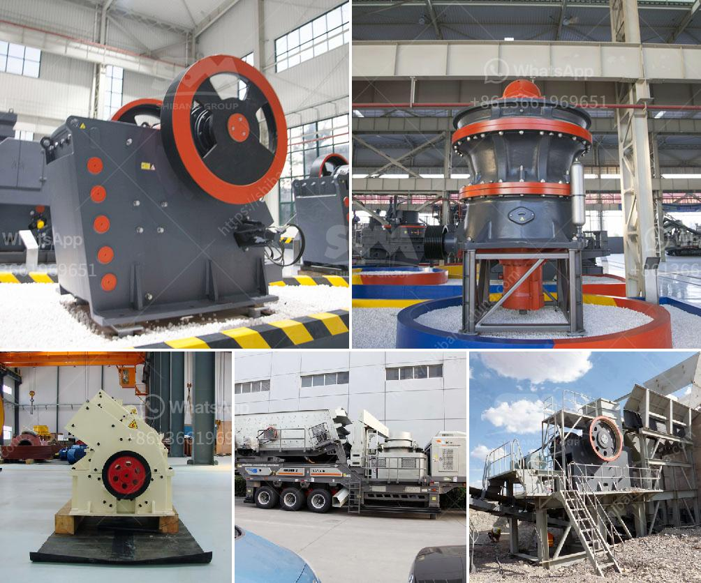

<h3>talc mining crusher process</h3>
Talc is a mineral composed of hydrated magnesium silicate with the chemical formula Mg3Si4O10(OH)2. It is widely used in various industries such as cosmetics, ceramics, paint, paper, and more. The process of extracting talc begins with exploration. Geologists study the earth's surface, looking for areas that have the potential for talc deposits. Once a suitable location is found, the next step is mining.

Mining talc involves several steps. The first step in the process is blasting the ore-bearing rock. This is done with controlled explosives to break the rock into smaller fragments. After the blasting, the fragments are loaded into haul trucks and transported to a primary crusher.

The primary crusher reduces the size of the fragments to manageable pieces. The crushed talc ore is then conveyed to a secondary crusher for further size reduction. The secondary crusher is usually a cone crusher or impact crusher, which is used to crush the talc into smaller fragments.

The talc particles are then screened by the vibrating screen, and the size of the talc particles that meet the requirements is sent to the storage bin through the bucket elevator. The fraction that does not meet the requirements is returned to the crusher for further crushing.

Once the talc particles are stored in the bin, they are usually transported to the grinding mill for processing. Grinding mills such as Raymond mill, ultrafine mill, vertical roller mill, and ball mill are commonly used in talc grinding process. The final product can be controlled freely from 325 to 2500 meshes.

Talc powder is widely used in various industries, and it is an essential material in countless products. The talc powder can be used as a filler in countless products. It provides a smoother texture, improves the consistency, and enhances the overall quality of the product. It is commonly found in cosmetic products such as baby powder, face powder, and blush.

In conclusion, the process of mining talc involves several steps, including exploration, blasting, crushing, screening, grinding, and storage. The crushed talc particles are then transported to the grinding mill for further processing. Talc mining plays a crucial role in the industrial sector, and it provides countless benefits to the final products. From cosmetics to ceramics, talc is widely used, making the mining process an essential part of many industries.
<h3>Contact us</h3><ul><li><strong>Whatsapp:&nbsp;<a href="https://wa.me/8613661969651">+8613661969651</a></strong></li><li><a href="https://swt.shibang-china.com/?git&amp;zhl&amp;talc mining crusher process"><strong>Online Service(chat now)</strong></a></li></ul><h3>Related</h3><ul><li><a href='buy used crushing coal screen plant.md'>buy used crushing coal screen plant</a></li><li><a href='uses of stone crusher equipment pdf.md'>uses of stone crusher equipment pdf</a></li><li><a href='on sale used quarry machinery uk.md'>on sale used quarry machinery uk</a></li><li><a href='jaw crusher prices saudi.md'>jaw crusher prices saudi</a></li><li><a href='50 tph raymond mills.md'>50 tph raymond mills</a></li></ul>