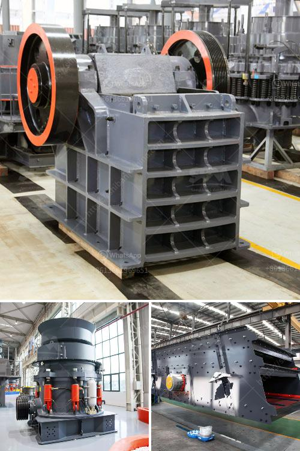

<h3>talc powder conveying systems</h3>
Talc powder conveying systems play a crucial role in various industries, enabling the efficient transportation of talc powder from one location to another. Talc powder, known for its unique properties such as its softness, smoothness, and high heat resistance, is widely used in industries such as cosmetics, pharmaceuticals, plastics, and ceramics.

One of the key benefits of using a talc powder conveying system is the ability to transport large quantities of powder quickly and efficiently. These systems are designed to handle heavy loads, ensuring a continuous flow of talc powder throughout the production process. By automating the transportation process, industries can significantly reduce manual labor and enhance productivity.

Talc powder conveying systems are commonly equipped with advanced technologies such as pneumatic conveyors or mechanical conveyors, depending on the specific requirements of the industry. Pneumatic conveyors use air pressure to transport talc powder through a pipeline, while mechanical conveyors rely on belts, screw conveyors, or bucket elevators to move the powder.

In addition to the transportation capabilities, talc powder conveying systems also offer several other advantages. These systems minimize the risk of contamination by ensuring a sealed and hygienic environment during the transportation process. This is particularly crucial in industries such as pharmaceuticals and food processing, where product purity is paramount.

Furthermore, modern talc powder conveying systems are designed with safety in mind. They incorporate various safety features such as emergency stop buttons, automatic control systems, and sensor-based technology to prevent accidents or equipment malfunctions.

Overall, talc powder conveying systems contribute significantly to the efficiency, productivity, and safety of industries that rely on talc powder in their manufacturing processes. With their ability to handle large quantities of powder, ensure product purity, and enhance operational safety, these systems prove to be an indispensable asset for industries worldwide.
<h3>Contact us</h3><ul><li><strong>Whatsapp:&nbsp;<a href="https://wa.me/8613661969651">+8613661969651</a></strong></li><li><a href="https://swt.shibang-china.com/?git&amp;zhl&amp;talc powder conveying systems"><strong>Online Service(chat now)</strong></a></li></ul><h3>Related</h3><ul><li><a href='crushing plant in montalban.md'>crushing plant in montalban</a></li><li><a href='ball mills mfg in kenya.md'>ball mills mfg in kenya</a></li><li><a href='tonne ball mill.md'>tonne ball mill</a></li><li><a href='accessories for conveyor belts.md'>accessories for conveyor belts</a></li><li><a href='china limestone jaw crusher machine.md'>china limestone jaw crusher machine</a></li></ul>