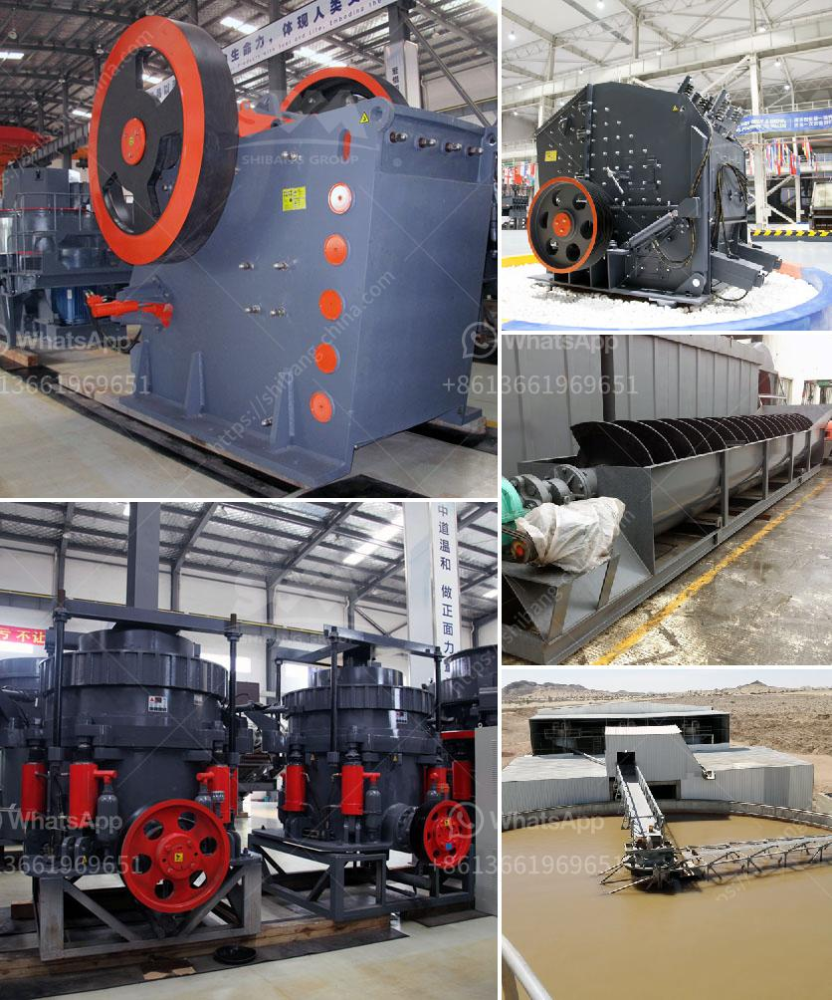

<h3>tanzania processing plant cost</h3>
With its abundant natural resources and diverse agricultural sector, Tanzania presents a promising investment opportunity for setting up a processing plant. However, potential investors need to carefully evaluate the costs involved in establishing and operating a processing plant in order to make informed decisions. This article aims to provide an overview of the key factors influencing the costs of setting up a processing plant in Tanzania.

One of the primary factors affecting the cost of establishing a processing plant is the availability and reliability of infrastructure and utilities. Tanzania has made significant progress in developing its infrastructure, but challenges such as weak road networks and limited access to electricity can impact the cost. Investors must analyze the location of the plant to ensure proximity to transport routes and the availability of utilities.

The capacity and design of the processing plant directly impact the cost. A larger processing plant typically requires more capital investment to purchase or lease a suitable manufacturing facility. Additionally, the choice of technology and equipment will influence the overall cost, as more advanced machinery tends to be pricier. It is crucial to conduct a detailed feasibility study to determine the optimal plant size and design that aligns with the market demand and budget.

Setting up a processing plant in Tanzania requires compliance with various permits and regulations. Investors should account for the costs associated with acquiring licenses, clearances, and certifications from relevant government agencies. Engaging legal and consulting services can help navigate the bureaucratic processes and ensure all legal obligations are met, albeit at an additional cost.

The availability of skilled and trained labor is a crucial consideration when estimating the operational costs of a processing plant. Tanzania has a large and growing workforce, but finding skilled workers might be a challenge in specific regions. Recruitment costs, training programs, and salary payments should be factored into the overall costs. Government subsidy programs and partnerships with local training institutions can help alleviate some training expenses.

The cost and accessibility of raw materials play a significant role in successful plant operations. Identifying reliable sources of raw materials and analyzing the logistics and transportation costs are paramount. Developing relationships and partnerships with local farmers, cooperatives, or other suppliers can help control costs and ensure a consistent supply chain.

Beyond initial setup costs, investors must consider ongoing operational and maintenance expenses. These include running costs for utilities, regular equipment maintenance, raw material storage, packaging materials, and staff salaries. It is vital to factor in these recurrent expenses to ensure the plant remains financially sustainable and profitable in the long run.

Setting up a processing plant in Tanzania can be a lucrative investment opportunity, given the country's abundant resources and agricultural potential. However, potential investors must evaluate the costs associated with infrastructure and utilities, plant size and design, permits and regulations, labor and training, raw material sourcing, as well as operating and maintenance expenses. Conducting thorough research, feasibility studies, and seeking professional advice can help investors make informed decisions, minimize costs, and maximize the benefits of establishing a processing plant in Tanzania.
<h3>Contact us</h3><ul><li><strong>Whatsapp:&nbsp;<a href="https://wa.me/8613661969651">+8613661969651</a></strong></li><li><a href="https://swt.shibang-china.com/?git&amp;zhl&amp;tanzania processing plant cost"><strong>Online Service(chat now)</strong></a></li></ul><h3>Related</h3><ul><li><a href='dolomite powder uses in agriculture.md'>dolomite powder uses in agriculture</a></li><li><a href='france used conveyor belts for sale.md'>france used conveyor belts for sale</a></li><li><a href='impact crusher equipment.md'>impact crusher equipment</a></li><li><a href='crusher in malaysia.md'>crusher in malaysia</a></li><li><a href='ball mill particle size in micrometets.md'>ball mill particle size in micrometets</a></li></ul>