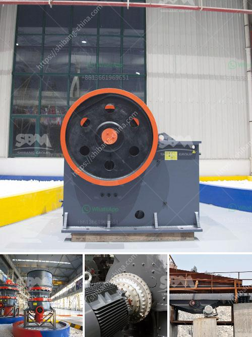

<h3>tata stone crusher machines nairobi</h3>
Tata stone crusher machines in Nairobi are a rare find, thanks to the high prevalence of ore crushers in the region. However, the latest developments in the industry have provided a ray of hope for crushers seeking to expand their market presence in the city. Tata stone crusher machines have been designed with advanced technology to ensure reliable performance and long service life.

One of the key features that sets Tata stone crusher machines apart from their competitors is their ability to process a wide range of materials. From soft limestone to hard granite, these machines are capable of handling various types of rocks with ease. This versatility makes them an ideal choice for construction companies and road builders who require a crusher that can handle different types of projects.

Another significant advantage of Tata stone crusher machines is their high crushing efficiency. Whether it's a small pebble or a large boulder, these machines can quickly and effectively reduce the size of the material. This not only saves time but also reduces the amount of energy required for crushing, resulting in lower operational costs.

In addition to their efficiency, Tata stone crusher machines are known for their exceptional durability. The robust construction of these machines ensures that they can withstand the harshest working conditions without succumbing to wear and tear. This makes them a cost-effective investment for businesses looking for reliable and long-lasting equipment.

Furthermore, Tata stone crusher machines are designed with the operator's comfort and safety in mind. The intuitive controls and ergonomic design of these machines provide a user-friendly experience. This allows operators to efficiently operate the machines without any unnecessary strain or risk of accidents.

The availability of spare parts and after-sales service is another area where Tata stone crusher machines excel. With a strong network of service centers and an extensive inventory of spare parts, Tata ensures that their customers are well-supported throughout the machine's lifespan. This ensures minimal downtime and maximum productivity for businesses relying on these crushers.

When it comes to environmental sustainability, Tata stone crusher machines are compliant with international emission standards. The incorporation of advanced technology and efficient design features helps to reduce carbon footprint and impact on the environment. This makes Tata stone crusher machines an environmentally friendly choice for businesses aiming to minimize their ecological impact.

In conclusion, Tata stone crusher machines in Nairobi offer a promising solution for various crushing needs in the city. They are efficient, durable, user-friendly, and environmentally friendly. With their versatility, these machines can handle different types of materials, ensuring that they can cater to a wide range of projects. Whether it's a construction company or a road builder, Tata stone crusher machines can deliver reliable performance and long service life.

By investing in Tata stone crusher machines, businesses in Nairobi can benefit from cost savings, increased productivity, and reduced environmental impact. The machines' availability of spare parts and after-sales service further ensures minimal downtime and maximum uptime. Overall, Tata stone crusher machines are a worthy investment for companies seeking high-quality crushing equipment.
<h3>Contact us</h3><ul><li><strong>Whatsapp:&nbsp;<a href="https://wa.me/8613661969651">+8613661969651</a></strong></li><li><a href="https://swt.shibang-china.com/?git&amp;zhl&amp;tata stone crusher machines nairobi"><strong>Online Service(chat now)</strong></a></li></ul><h3>Related</h3><ul><li><a href='4 rolar raymond mill productions.md'>4 rolar raymond mill productions</a></li><li><a href='quarry stone crusherequipment.md'>quarry stone crusherequipment</a></li><li><a href='crusher impact germany.md'>crusher impact germany</a></li><li><a href='clay beneficiation process.md'>clay beneficiation process</a></li><li><a href='crushed aggregates supplier in negros.md'>crushed aggregates supplier in negros</a></li></ul>