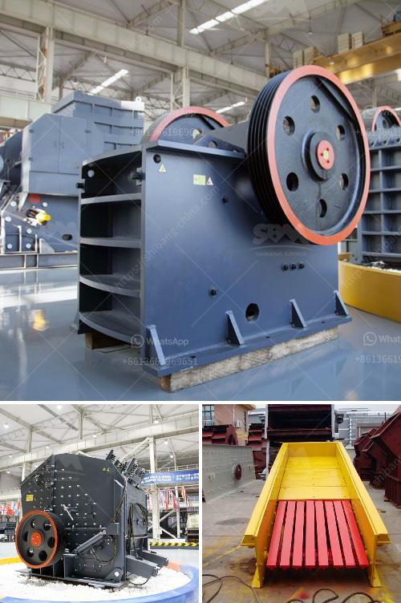

<h3>tempat rental stone crusher</h3>
Are you in the construction industry looking for a reliable and efficient way to crush and recycle stones? If you are, then you may need to consider renting a stone crusher machine. In this article, we will discuss the various factors that you should consider when looking for a stone crusher machine to rent.

Most importantly, you need to find a reputable distributor that offers high-quality machines. This is essential because a durable and efficient stone crusher machine will ensure that you can complete your project successfully and on time. So, where can you find such a distributor? Well, there are many options available, but one popular option is to rent from a temporary rental stone crusher company.

Tempat Rental Stone Crusher, as the name suggests, is a company that provides rental services for stone crusher machines. These machines are specifically designed to break down large rocks into smaller stones and rock dust, which can then be used for a variety of construction purposes. The stone crushing industry is an important part of the construction sector and plays a crucial role in the overall development of the country.

So, why should you consider renting a stone crusher machine? The answer is simple: it offers several advantages over purchasing one. Firstly, renting is a cost-effective solution as it eliminates the need for a large upfront investment. Instead, you can pay an affordable rental fee and have access to a high-quality machine for the duration of your project. This allows you to save money that can be invested in other aspects of your construction project.

Secondly, renting provides flexibility and convenience. You can choose the duration of the rental period based on your project's requirements. Whether you need the machine for a day, a week, or a month, you can easily arrange a rental agreement that suits your needs. Additionally, you won't have to worry about maintenance and storage costs as they are covered by the rental company.

Furthermore, renting a stone crusher machine eliminates the need for specialized training or hiring skilled operators. The rental company will provide you with a qualified operator who has the expertise to operate the machine. This ensures the safety and efficiency of your project without the extra hassle of training or hiring additional staff.

When renting a stone crusher machine, there are a few things to keep in mind. Firstly, consider the size and capacity of the machine. The crusher should be able to handle the rocks and stones you need to crush. Smaller machines will have a lower capacity, which could result in delays or inefficiency. It is essential to choose a machine with the right capacity to meet your project requirements.

Secondly, consider the type of stone you are crushing. Different stones have different hardness levels, and not all crushers are designed to handle all types of stones. It is crucial to choose a machine that is specifically designed for the type of stone you are working with. This will ensure that the machine can crush the stone effectively without causing damage.

In conclusion, renting a stone crusher machine from Tempat Rental Stone Crusher can be a cost-effective and convenient way to crush stones for your construction projects. Being able to access a high-quality machine without the need for a large investment upfront is an excellent advantage. Consider the size, capacity, and type of stone you need to crush when choosing a machine to ensure maximum efficiency and productivity.
<h3>Contact us</h3><ul><li><strong>Whatsapp:&nbsp;<a href="https://wa.me/8613661969651">+8613661969651</a></strong></li><li><a href="https://swt.shibang-china.com/?git&amp;zhl&amp;tempat rental stone crusher"><strong>Online Service(chat now)</strong></a></li></ul><h3>Related</h3><ul><li><a href='india vertical grinding machines.md'>india vertical grinding machines</a></li><li><a href='ball mill machine.md'>ball mill machine</a></li><li><a href='stone crusher project report.md'>stone crusher project report</a></li><li><a href='how the screw sand washing works.md'>how the screw sand washing works</a></li><li><a href='silica sand crusher rajasthan.md'>silica sand crusher rajasthan</a></li></ul>