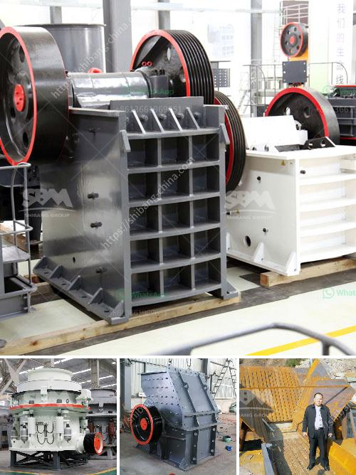

<h3>tertiary impact crushers</h3>
In the construction industry, aggregate is essential for creating strong and durable structures. It is the foundation upon which roads, bridges, buildings, and other infrastructures are built. As the demand for high-quality aggregate continues to grow, manufacturers are constantly seeking innovative solutions to produce aggregate that meets the industry's stringent requirements. Tertiary impact crushers have emerged as a reliable and efficient solution for producing fine aggregates.

Tertiary impact crushers are designed for crushing soft and medium-hard materials such as limestone, gypsum, and dolomite. They are capable of producing a high percentage of cubical-shaped aggregates, making them ideal for the production of concrete and asphalt. Unlike primary and secondary crushers, which break down the materials into smaller sizes, tertiary impact crushers are designed to further reduce the size of the aggregates efficiently.

One of the key advantages of tertiary impact crushers is their high production capacity. These crushers are equipped with powerful rotors that deliver high rotational speeds, enabling them to generate a significant amount of energy. This energy, combined with their special crushing chamber design, results in a high production rate. Tertiary impact crushers can produce up to 80% fine aggregates, ensuring a higher yield per ton of raw material.

Another advantage of tertiary impact crushers is their versatility. These crushers can be used in various applications, including limestone, glass, and recycling. Their adjustable crushing chamber allows users to adjust the size of the final product according to their specific needs. This flexibility makes tertiary impact crushers suitable for a wide range of projects, from building roads to manufacturing concrete blocks.

Moreover, tertiary impact crushers are known for their low maintenance requirements. They are designed with easily replaceable wear parts, such as the impact plates and blow bars, which can be quickly and easily replaced without the need for specialized tools. This reduces downtime and ensures continuous operation, minimizing the impact on production schedules.

In terms of safety, tertiary impact crushers are equipped with advanced features to protect both the operator and the machine. These features include hydraulic opening mechanisms for easy access to the crushing chamber and safety devices to prevent accidental startup or overloading of the crusher. Additionally, tertiary impact crushers are designed with sturdy and robust structures that can withstand the harsh conditions of the construction site, ensuring a long service life.

In conclusion, tertiary impact crushers are a valuable tool for producing high-quality aggregate in the construction industry. Their ability to produce fine aggregates with a high percentage of cubical shapes, combined with their high production capacity, make them an ideal choice for aggregate manufacturers. Their versatility, low maintenance requirements, and safety features further enhance their value. As the demand for high-quality aggregate continues to rise, tertiary impact crushers will play an increasingly important role in meeting the industry's requirements.
<h3>Contact us</h3><ul><li><strong>Whatsapp:&nbsp;<a href="https://wa.me/8613661969651">+8613661969651</a></strong></li><li><a href="https://swt.shibang-china.com/?git&amp;zhl&amp;tertiary impact crushers"><strong>Online Service(chat now)</strong></a></li></ul><h3>Related</h3><ul><li><a href='companies that sell conveyor belts.md'>companies that sell conveyor belts</a></li><li><a href='crusher in argentina stone crusher.md'>crusher in argentina stone crusher</a></li><li><a href='mill balls for mill in bolivia.md'>mill balls for mill in bolivia</a></li><li><a href='construction of roller mill.md'>construction of roller mill</a></li><li><a href='propel stone crusher.md'>propel stone crusher</a></li></ul>