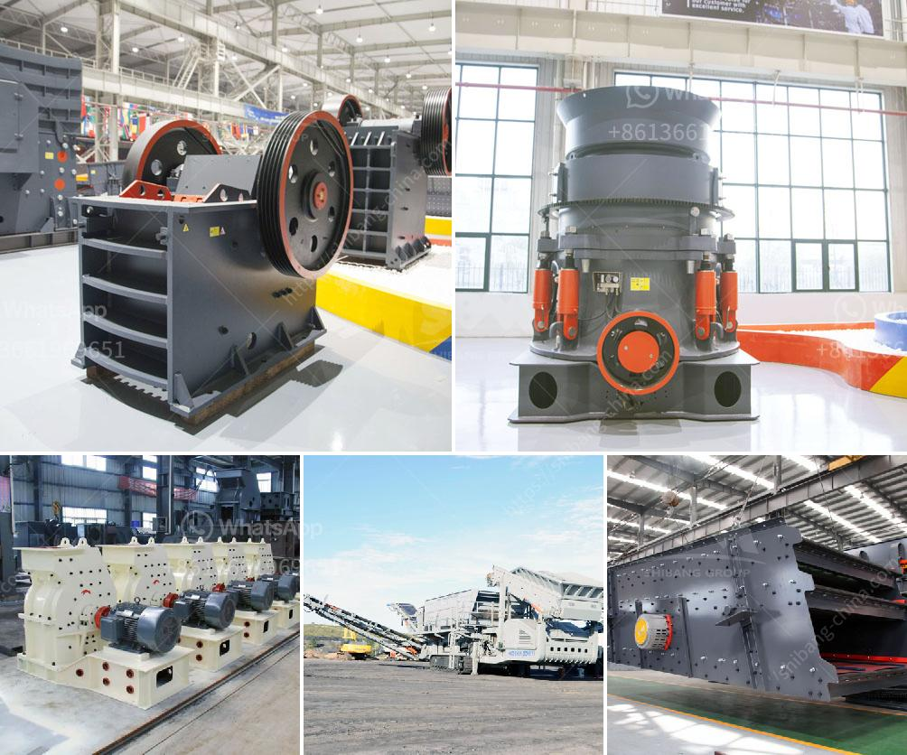

<h3>thailand coconut processing machine</h3>
Thailand is renowned for its vibrant agricultural industry, and one of its most iconic exports is coconuts. With an abundance of coconut plantations across the country, Thailand has become a major player in the global coconut market. To maintain its competitive edge, Thailand has embraced advanced technology in coconut processing machines, enhancing efficiency and quality.

Coconut processing machines are used to extract various products from coconuts, such as coconut oil, coconut milk, and coconut water. These machines streamline the production process, improving productivity and ensuring consistency in product quality.

One of the key advantages of modern coconut processing machines is their ability to automate traditionally labor-intensive tasks. Machines can now grate, extract, and separate coconut meat, helping farmers save time and effort. This increased efficiency has resulted in higher productivity and reduced production costs.

Additionally, coconut processing machines have improved the overall quality of coconut-based products. By automating the processing steps, machines ensure that coconuts are handled hygienically and maintain their natural taste and aroma. The use of advanced technology also minimizes human error, resulting in a more consistent and standardized end product.

Thailand has been at the forefront of developing advanced coconut processing machines. Local manufacturers have invested in research and development, creating innovative solutions tailored to the unique needs of coconut farmers. These machines are not only highly efficient but also cost-effective, making them accessible to small-scale farmers as well.

The demand for coconut-based products has been steadily increasing worldwide, driven by growing consumer awareness of the health benefits and versatility of coconuts. Thailand's investment in modern coconut processing machines has positioned the country as a reliable supplier of high-quality coconut products.

As global competition intensifies, efficiency and product quality are paramount for coconut farmers and manufacturers. With the use of coconut processing machines, Thailand has successfully improved productivity, reduced costs, and enhanced product quality. These machines have proven to be invaluable in sustaining Thailand's status as a leading exporter of coconut-based products worldwide.
<h3>Contact us</h3><ul><li><strong>Whatsapp:&nbsp;<a href="https://wa.me/8613661969651">+8613661969651</a></strong></li><li><a href="https://swt.shibang-china.com/?git&amp;zhl&amp;thailand coconut processing machine"><strong>Online Service(chat now)</strong></a></li></ul><h3>Related</h3><ul><li><a href='stone crusher equipment supplier.md'>stone crusher equipment supplier</a></li><li><a href='quarry stone crusherequipment.md'>quarry stone crusherequipment</a></li><li><a href='stone crusher sale.md'>stone crusher sale</a></li><li><a href='primary jaw crusher.md'>primary jaw crusher</a></li><li><a href='barite powder making.md'>barite powder making</a></li></ul>