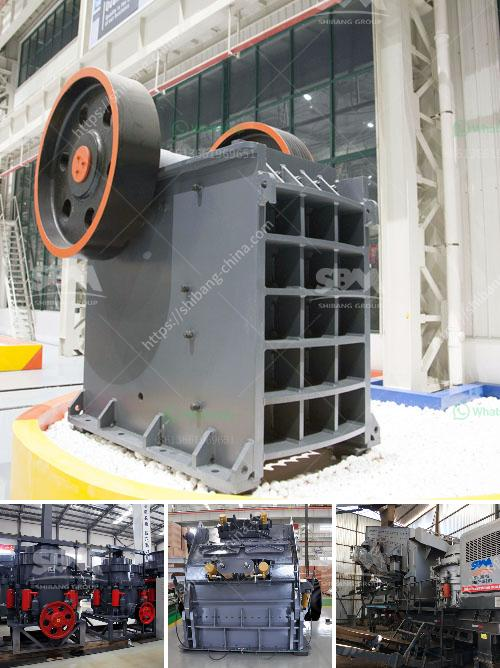

<h3>ton grinding unit cement plant cost</h3>
The cement industry is one of the most important industries worldwide. It plays a crucial role in infrastructure development, providing the essential ingredient for building homes, offices, bridges, and roads. Cement is produced through the process of grinding clinker, which is heated and ground into a fine powder. One of the key components required to set up a cement plant is a grinding unit.

A grinding unit forms an integral part of the cement manufacturing process and is responsible for grinding clinker, gypsum, and other additives like fly ash, slag, and limestone into a suitable fine powder, used as the final product. Modern cement grinding units consist of a ball mill in closed circuit with a high-efficiency separator, enhancing the grinding efficiency and reducing energy consumption. The cost of setting up a grinding unit may vary depending on the specific requirements and the level of technology utilized.

Setting up a grinding unit involves various factors like land availability, machinery costs, civil construction costs, and other infrastructure expenses. The choice of location for the plant is crucial, as it affects transportation costs and availability of raw materials. Proximity to limestone mines, which provide the primary raw material, is necessary to ensure consistent supply and minimize transportation expenses.

Machinery costs depend on the technology chosen for grinding clinker. While traditional ball mills are still widely used, new technologies like vertical roller mills (VRM) and high-pressure grinding rolls (HPGR) offer higher energy efficiency and reduced maintenance costs. However, the initial investment required for such advanced technologies may be higher.

Civil construction costs include the expenditure incurred in building the plant structure, including the grinding unit, storage silos, administrative offices, and other auxiliary buildings. These costs depend on the size of the plant and the quality of construction materials used.

Other infrastructure expenses include electricity supply, water availability, and waste management facilities. Cement grinding units require a significant amount of electricity, accounting for a substantial portion of the overall operational costs. Hence, proximity to a reliable power source is essential. Adequate water supply is also necessary for the production process, and wastewater treatment facilities are required to comply with environmental regulations.

Additionally, regulatory approvals, legal expenses, and financial costs like interest during construction must be factored in when estimating the overall cost of setting up a grinding unit.

The total cost of establishing a grinding unit can range from a few million dollars to tens of millions of dollars, depending on the scale of the operation and the level of automation implemented. It is important to conduct a feasibility study and assess the market demand, competition, and potential profitability before investing in a cement grinding unit.

Despite the initial investment required, setting up a grinding unit can be a profitable venture in the long run. The demand for cement is expected to continue growing, driven by urbanization, infrastructure development, and construction activities. Investing in energy-efficient technologies can help reduce operational costs, enhance sustainability, and improve the overall competitiveness of the cement plant.

In conclusion, a cement grinding unit is a crucial component in the cement manufacturing process. The cost of setting up a grinding unit depends on various factors like location, machinery costs, civil construction costs, and other infrastructure expenses. Proper planning and assessment are necessary to ensure the long-term profitability and sustainability of the grinding unit.
<h3>Contact us</h3><ul><li><strong>Whatsapp:&nbsp;<a href="https://wa.me/8613661969651">+8613661969651</a></strong></li><li><a href="https://swt.shibang-china.com/?git&amp;zhl&amp;ton grinding unit cement plant cost"><strong>Online Service(chat now)</strong></a></li></ul><h3>Related</h3><ul><li><a href='quotation for crusher.md'>quotation for crusher</a></li><li><a href='fortius roller mill.md'>fortius roller mill</a></li><li><a href='buy jaw crusher machine.md'>buy jaw crusher machine</a></li><li><a href='copper mining machine.md'>copper mining machine</a></li><li><a href='raymond machine for sale.md'>raymond machine for sale</a></li></ul>