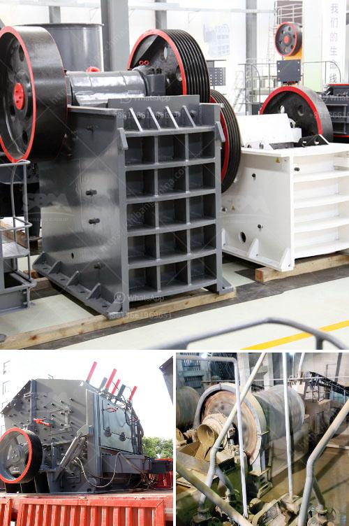

<h3>toner powder making machine</h3>
In the world of printing, toner powder is an essential component for achieving high-quality prints. Toner powder, also known as laser printer toner, is used in laser printers and photocopiers to create sharp and vibrant images and text. The process of producing toner powder involves various intricate steps, and this is where a toner powder making machine comes into play.

A toner powder making machine is a cutting-edge piece of equipment that is specifically designed to produce top-notch toner powder. It transforms raw materials into a fine and consistent powder that can be used in printing devices. This machine plays a vital role in the printing industry by providing manufacturers with the means to create exceptional toner powder efficiently and cost-effectively.

One of the key advantages of using a toner powder making machine is its ability to produce high-quality toner powder consistently. These machines are equipped with advanced technologies that ensure precise control over the manufacturing process. By maintaining a controlled environment and monitoring various parameters such as temperature, pressure, and particle size, these machines can produce toner powder with superior consistency and quality.

Moreover, toner powder making machines offer significant benefits in terms of efficiency and productivity. With their automated operations and high-speed production capabilities, these machines enable manufacturers to streamline their production process, reduce labor costs, and enhance overall productivity. The accuracy and precision of these machines also lead to minimal material wastage, resulting in cost savings and environmental sustainability.

Another notable advantage of toner powder making machines is their versatility. These machines can produce toner powder for a wide range of printing applications, catering to the diverse needs of different industries. Whether it is for printing documents, brochures, labels, or packaging materials, these machines can adapt to the specific requirements of each application, delivering exceptional results.

In conclusion, a toner powder making machine is a game-changer in the realm of printing innovation. It offers manufacturers the means to produce high-quality and consistent toner powder efficiently, enhancing productivity and reducing costs. With their advanced technologies and versatility, these machines are revolutionizing the way toner powder is manufactured, further driving the progress of the printing industry.
<h3>Contact us</h3><ul><li><strong>Whatsapp:&nbsp;<a href="https://wa.me/8613661969651">+8613661969651</a></strong></li><li><a href="https://swt.shibang-china.com/?git&amp;zhl&amp;toner powder making machine"><strong>Online Service(chat now)</strong></a></li></ul><h3>Related</h3><ul><li><a href='calcite mining equipment.md'>calcite mining equipment</a></li><li><a href='best jaw crusher for making stone.md'>best jaw crusher for making stone</a></li><li><a href='manufacturer of quartz powder in karnataka.md'>manufacturer of quartz powder in karnataka</a></li><li><a href='manufacturer of crusher plant of bajri from rajkot.md'>manufacturer of crusher plant of bajri from rajkot</a></li><li><a href='quarry crusher supplier.md'>quarry crusher supplier</a></li></ul>