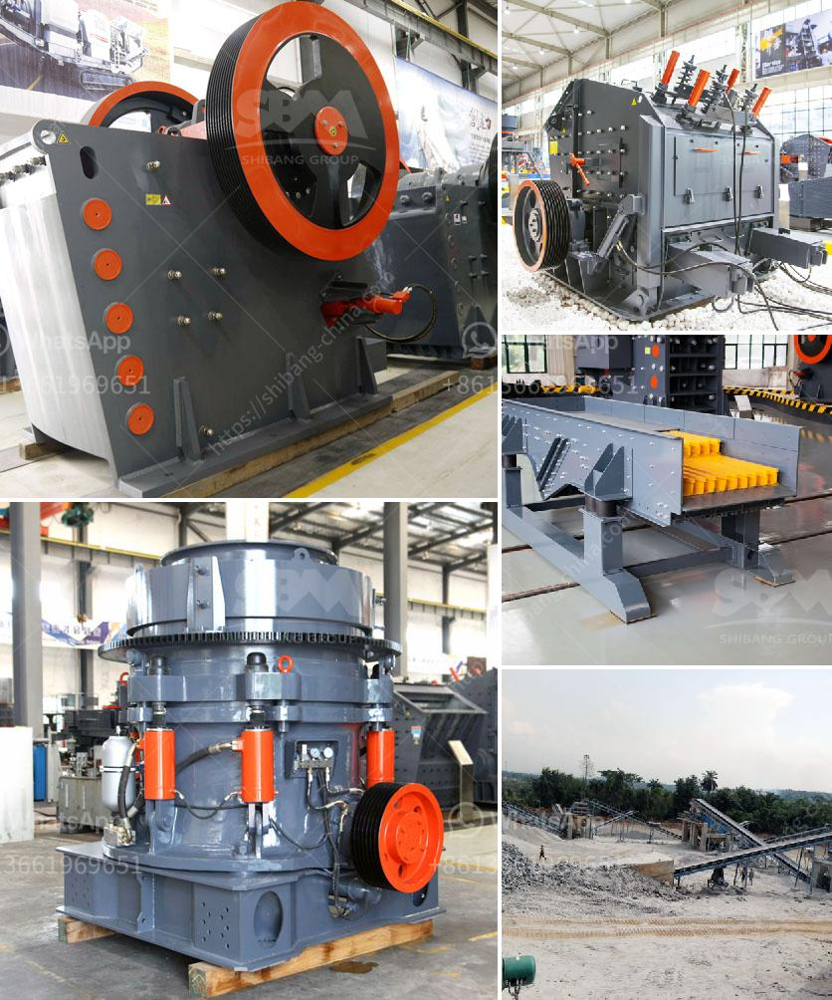

<h3>tonne ball mill</h3>
A tonne ball mill refers to a type of grinding mill that is used exclusively for heavy-duty grinding purposes. The key components of this type of mill are the shell and the balls inside it. The shell is made up of steel plates and is typically cylindrical in shape and is horizontally positioned. The balls on the other hand are made up of steel or other materials and are used to grind materials into a fine powder.

Tonne ball mills are widely used in various industries such as mining, construction, and manufacturing. In the mining industry, these mills are used to grind ores and other minerals to liberate them from the surrounding rock. This liberation process allows the valuable minerals to be separated from the waste material and enables further processing.

The construction industry also benefits from using tonne ball mills. In this industry, these mills are used to grind materials such as cement and aggregates, which are then used to produce concrete. The grinding action of the mill helps to break down these materials and ensure a consistent particle size, resulting in high-quality concrete.

Manufacturing industries, especially those involved in the production of ceramics, pigments, and chemicals, also utilize tonne ball mills. These mills are crucial in the process of grinding raw materials and transforming them into a desired product. The ability of the balls inside the mill to create friction and impact is crucial in achieving the desired grind size and product quality.

One of the key advantages of a tonne ball mill is its versatility. These mills can be used for both wet and dry grinding applications. Wet grinding involves the addition of water or other liquids to the mill, whereas dry grinding involves no additional liquids. This flexibility allows for the efficient processing of a wide range of materials, regardless of their moisture content.

The capacity of a tonne ball mill can vary depending on factors such as the size and hardness of the material being ground, the desired grind size, and the milling duration. Typically, these mills can process several tons of material per hour, making them ideal for large-scale grinding operations.

Another advantage of tonne ball mills is their cost-effectiveness. These mills have a relatively low operating cost compared to other grinding mills. They are energy efficient and require less maintenance and spare parts, resulting in lower overall operational costs.

In conclusion, the tonne ball mill is a versatile and cost-effective grinding mill that is widely used in various industries. Its ability to grind a wide range of materials, its low operating cost, and its flexibility make it an essential tool in many industrial processes. Whether it is in the mining, construction, or manufacturing industry, the tonne ball mill can efficiently grind materials and contribute to the production of high-quality products.
<h3>Contact us</h3><ul><li><strong>Whatsapp:&nbsp;<a href="https://wa.me/8613661969651">+8613661969651</a></strong></li><li><a href="https://swt.shibang-china.com/?git&amp;zhl&amp;tonne ball mill"><strong>Online Service(chat now)</strong></a></li></ul><h3>Related</h3><ul><li><a href='barite powder processing plant process flow diagram.md'>barite powder processing plant process flow diagram</a></li><li><a href='mobile stone crusher price south africa for cement in usa.md'>mobile stone crusher price south africa for cement in usa</a></li><li><a href='used cement clinker grinding plant.md'>used cement clinker grinding plant</a></li><li><a href='crusher operator salary in uae and dubai.md'>crusher operator salary in uae and dubai</a></li><li><a href='price of stone crusher machine in pakistan.md'>price of stone crusher machine in pakistan</a></li></ul>