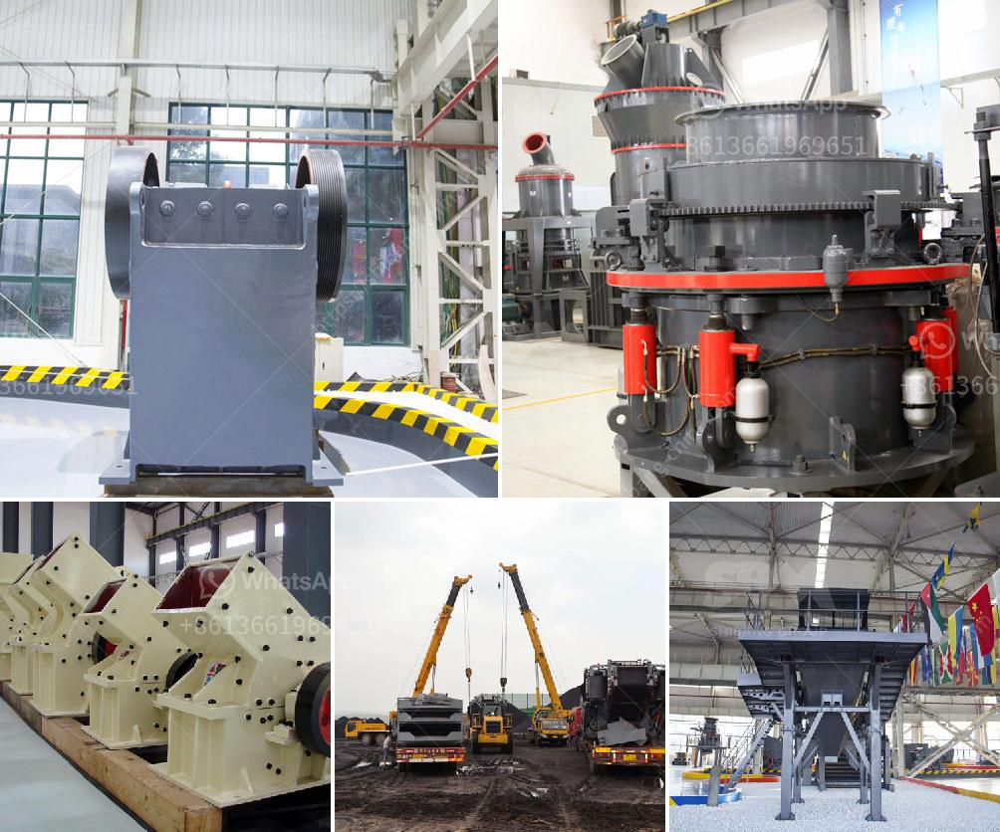

<h3>tonne mobile crusher for sale philippines</h3>
Are you in need of a heavy-duty machine that can crush large rocks into smaller sized aggregate materials? Look no further than a tonne mobile crusher. In the Philippines, there are several models of mobile crushing plants available, each with different capacities and capabilities. These machines are perfect for construction companies, mining operations, and other industries that require the processing of various types of materials.

One of the main advantages of a tonne mobile crusher is its portability. The ability to move the machine from one site to another makes it a cost-effective and efficient solution for crushing rocks on the go. Whether you need to crush rocks at a construction site or process aggregates in a mining operation, a tonne mobile crusher can easily be transported to different locations with minimal setup time. This versatility allows for increased productivity and reduced downtime, ultimately leading to higher profits.

Another key feature of a tonne mobile crusher is its impressive crushing capacity. With the ability to handle large volumes of materials, these machines can crush rocks of varying sizes into smaller, more manageable pieces. This is particularly useful in construction projects where the crushed aggregate can be used as a base material for road construction or as a component in concrete mixtures. The high crushing capacity of a tonne mobile crusher ensures that even the toughest rocks can be efficiently processed.

When it comes to the maintenance of a tonne mobile crusher, manufacturers have designed the machines to be as user-friendly as possible. Many models come equipped with advanced features like automated lubrication systems and remote control operation, making it easy for operators to maintain the machine and keep it running smoothly. Regular maintenance and service checks are essential to ensure optimum performance and longevity of the crusher. By following the manufacturer's recommended maintenance schedule, you can ensure that your investment remains in good condition for years to come.

In the Philippines, there is a wide range of tonne mobile crushers available for sale. Depending on your specific requirements, you can choose from models with different crushing capacities, power options, and mobility features. It is essential to carefully consider your needs, budget, and the type of materials you plan to process before selecting a mobile crusher.

In conclusion, a tonne mobile crusher is an excellent investment for businesses in the Philippines that require a reliable and efficient crushing solution. With their portability, high crushing capacity, and user-friendly maintenance features, these machines can significantly enhance productivity and profitability. Whether for construction projects or mining operations, a tonne mobile crusher offers the versatility and performance necessary to tackle challenging crushing tasks. Start exploring the available options and find the perfect mobile crusher for your specific needs today.
<h3>Contact us</h3><ul><li><strong>Whatsapp:&nbsp;<a href="https://wa.me/8613661969651">+8613661969651</a></strong></li><li><a href="https://swt.shibang-china.com/?git&amp;zhl&amp;tonne mobile crusher for sale philippines"><strong>Online Service(chat now)</strong></a></li></ul><h3>Related</h3><ul><li><a href='ballast crushers cost.md'>ballast crushers cost</a></li><li><a href='quotation for crusher.md'>quotation for crusher</a></li><li><a href='tons per hour ball mill for sale in south africa.md'>tons per hour ball mill for sale in south africa</a></li><li><a href='small scall stone crushing machine.md'>small scall stone crushing machine</a></li><li><a href='limestone crushing and making sand machine.md'>limestone crushing and making sand machine</a></li></ul>