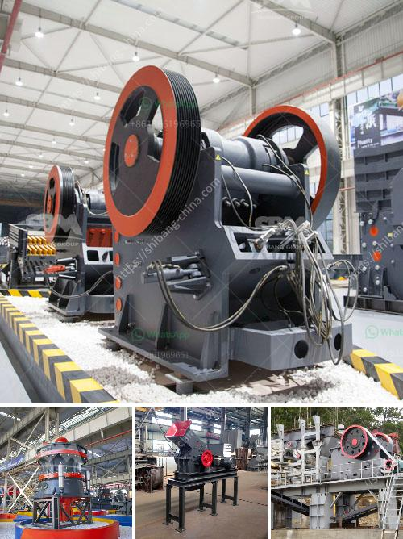

<h3>tonne per hour ball mill gold crushing</h3>
A tonne per hour ball mill is a large mechanical device used to grind ore and extract the desired metals and minerals. Recognized as an industry leader, we design and manufacture efficient ball mills for various mining and industrial applications, ensuring that our clients get the best processing equipment at an affordable price.

The gold crushing process requires a continuous supply of ore, which is typically delivered from a mine to the ball mill for grinding. Crushing produces finer particles that are fed into the ball mill for further processing.

Our robust and durable ball mills are designed to handle high-capacity mineral processing operations, processing up to 10 tonnes per hour. With a variety of sizes and specifications available, we can custom build a ball mill to meet the specific requirements of your gold mining project.

Apart from crushing and grinding, our ball mills are also used for mixing, homogenizing, and mechanical alloying of materials. This versatility makes them an essential tool in the mining industry.

In addition to their impressive performance, our ball mills are also energy-efficient, reducing the overall operational costs associated with gold processing. This sustainability aspect is especially important in today's eco-conscious world, as it minimizes the environmental impact of mining operations.

Our ball mills are manufactured with high-quality materials, ensuring both durability and operational efficiency. From the foundations to the necessary components, every aspect of our ball mills is engineered to deliver exceptional performance, day in and day out.

At [Company Name], we take pride in our commitment to delivering top-of-the-line ball mills for gold crushing applications. Our experienced team of engineers and technicians will work closely with you to ensure that you get a ball mill tailored to your needs.

Whether you're a small-scale miner or a large mining corporation, our dedicated team will provide you with the right solution. Contact us today to discuss your gold crushing requirements and discover how our ball mills can improve your operational efficiency and profitability.
<h3>Contact us</h3><ul><li><strong>Whatsapp:&nbsp;<a href="https://wa.me/8613661969651">+8613661969651</a></strong></li><li><a href="https://swt.shibang-china.com/?git&amp;zhl&amp;tonne per hour ball mill gold crushing"><strong>Online Service(chat now)</strong></a></li></ul><h3>Related</h3><ul><li><a href='ball mill iron ore only company.md'>ball mill iron ore only company</a></li><li><a href='500 ton per hr crusher price.md'>500 ton per hr crusher price</a></li><li><a href='how to grind mica for powder in small scale.md'>how to grind mica for powder in small scale</a></li><li><a href='ballast making machine for sale.md'>ballast making machine for sale</a></li><li><a href='copper processing floatation plant.md'>copper processing floatation plant</a></li></ul>