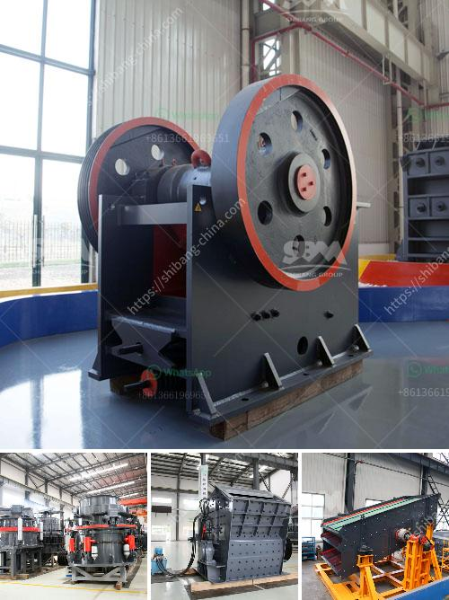

<h3>tonne stone crusher price for hire in cardiff</h3>
Have you ever wondered how tons of materials like aggregate, soil, gravel, or even mulch get processed and transformed into usable materials? If you are involved in any construction or landscaping projects in Cardiff, you may find yourself in need of a tonne stone crusher. This powerful machine is capable of pulverizing large rocks into smaller, more manageable sizes. But how much does it cost to hire a tonne stone crusher in Cardiff? Let's explore the pricing structure and benefits associated with this service.

The price for hiring a tonne stone crusher in Cardiff typically ranges from £250 to £300 per day. This includes the machine's delivery, transportation costs, as well as a skilled operator. Since the crusher needs to be maneuvered around uneven terrain and potentially through tight spaces, having an experienced operator ensures optimal efficiency and safe operation. Most companies offering stone crusher services in Cardiff will provide operators who are trained and reliable, giving you the peace of mind to focus on other aspects of your project.

The size and type of stone crusher required will depend on the specific needs of your project. A jaw crusher, for instance, is perfect for primary crushing tasks and can handle a variety of materials, including reinforced concrete. On the other hand, if you require finer materials, a cone crusher might be a better choice. Mobile crushers are also available, allowing you to bring the crusher directly to the job site, further reducing transport and handling costs.

One of the primary advantages of hiring a tonne stone crusher is its versatility. Whether you need materials for road construction, landscaping, or even creating a foundation for new structures, this crushing machine can handle it all. By crushing stones on-site, you eliminate the need to rely on suppliers, saving time and money. Additionally, you have complete control over the size and quality of the materials produced, ensuring they meet your specific requirements.

Furthermore, hiring a tonne stone crusher promotes sustainability. By recycling existing materials or crushing rocks that would otherwise be discarded, you contribute to reducing waste and preserving natural resources. This eco-friendly approach aligns with the growing environmental concerns and regulations, making stone crusher services an attractive choice for responsible construction and landscaping projects.

When considering the tonne stone crusher price for hire in Cardiff, it's important to evaluate the additional costs associated with the project. For instance, you may need to provide suitable fuel for the crusher, such as diesel or electricity. Additionally, the distance and accessibility of your site can impact transportation costs. However, most companies offering stone crusher services will provide transparent pricing and estimate all the potential costs upfront to avoid any surprises.

In conclusion, hiring a tonne stone crusher in Cardiff can provide you with a cost-effective and efficient solution for processing large rocks and creating usable materials for your construction or landscaping projects. The price typically ranges from £250 to £300 per day, including the machine, transportation, and an operator. With its versatility and eco-friendly benefits, a tonne stone crusher can be a valuable asset to your project.
<h3>Contact us</h3><ul><li><strong>Whatsapp:&nbsp;<a href="https://wa.me/8613661969651">+8613661969651</a></strong></li><li><a href="https://swt.shibang-china.com/?git&amp;zhl&amp;tonne stone crusher price for hire in cardiff"><strong>Online Service(chat now)</strong></a></li></ul><h3>Related</h3><ul><li><a href='quartz grit making machine.md'>quartz grit making machine</a></li><li><a href='placer mining wash plant operating costs.md'>placer mining wash plant operating costs</a></li><li><a href='silica sand mine owners in pakistan.md'>silica sand mine owners in pakistan</a></li><li><a href='alluvial chrome wash plant.md'>alluvial chrome wash plant</a></li><li><a href='stone crushing equipment.md'>stone crushing equipment</a></li></ul>