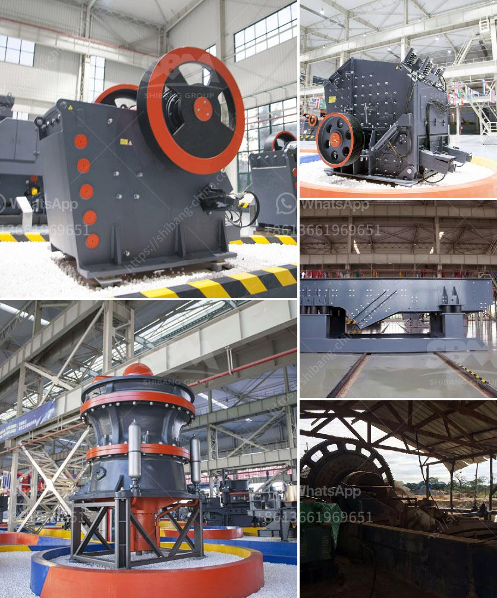

<h3>tons per hour ball mill for sale in south africa</h3>
If you are looking for a ball mill for sale in South Africa, one of the most important factors to consider is the tons per hour capacity of the mill. You will find ball mills in different sizes and capacities. However, if you need a ball mill with a specific capacity, there are several manufacturers to choose from, such as Metso, Telsmith, and FLSmidth.

The capacity of the ball mill determines the grinding efficiency. The higher the capacity, the more material can be processed in a single batch. A ball mill with a larger capacity can perform all grinding tasks efficiently and ensure excellent performance in terms of particle size distribution.

In South Africa, 100 tons per hour ball mills are commonly used. This is the ideal size for a smaller-scale production project. Not only can the ball mill grind the material to a fine powder, it can also be used for mixing different materials. Owing to its versatility and practicality, a ball mill is an essential piece of equipment for any mining or production operation.

When purchasing a ball mill, it is vital to take into account the required tons per hour capacity, as well as the material properties, such as hardness and abrasiveness. The lining type and media used in the ball mill can also affect the grinding efficiency and final product quality.

In conclusion, if you are in the market for a ball mill for sale in South Africa, you must consider the tons per hour capacity of the mill. Choose the right size and capacity to meet your needs, and ensure that you have the appropriate lining and grinding media to optimize performance. With the right equipment, you can achieve the desired grinding efficiency and produce high-quality products.
<h3>Contact us</h3><ul><li><strong>Whatsapp:&nbsp;<a href="https://wa.me/8613661969651">+8613661969651</a></strong></li><li><a href="https://swt.shibang-china.com/?git&amp;zhl&amp;tons per hour ball mill for sale in south africa"><strong>Online Service(chat now)</strong></a></li></ul><h3>Related</h3><ul><li><a href='mining belt conveyor systems.md'>mining belt conveyor systems</a></li><li><a href='crushing and screening costs.md'>crushing and screening costs</a></li><li><a href='ore crushing equipment.md'>ore crushing equipment</a></li><li><a href='crusher machine in europe.md'>crusher machine in europe</a></li><li><a href='price of a rock crusher.md'>price of a rock crusher</a></li></ul>