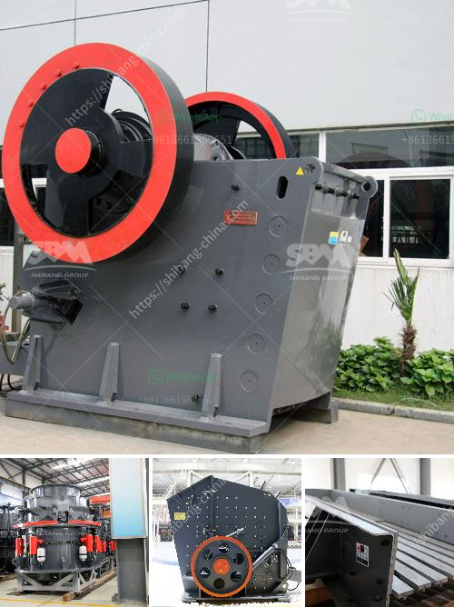

<h3>top mobile crusher</h3>
In today's fast-paced world, efficiency and productivity are crucial for any business. The construction and mining industries are no exception. More than ever, companies need to find innovative solutions to streamline their operations and maximize profitability. One technology that has emerged as a game-changer in the field is the top mobile crusher.

A mobile crusher is a machine designed to reduce large rocks and debris into smaller rocks, gravel, or rock dust. Crushers are used to break down stones and hard materials, which can be further used for various applications such as construction aggregates, asphalt, and concrete. The advent of mobile crushers has significantly improved the effectiveness and speed of crushing operations.

One of the top mobile crushers on the market is the Lokotrack® LT106™. Developed by Metso Outotec, a leading supplier of crushing and screening equipment, the LT106 offers high-performance crushing capabilities in a compact size. With a weight of only 40 tons, the machine is easy to transport and maneuver, making it ideal for work in tight spaces and on remote construction sites.

The Lokotrack LT106 features a robust Nordberg® C106™ jaw crusher, renowned for its reliability and efficiency. The crusher's large feed opening enables it to handle even the toughest materials, while the hydraulic drive ensures smooth and continuous operation. Additionally, the LT106 is equipped with Metso Outotec's IC™ process control system, allowing operators to manage and monitor the crushing process from the excavator cabin.

But what sets the Lokotrack LT106 apart from other mobile crushers is its fuel efficiency. The machine is equipped with a CAT® engine that complies with the latest emission standards, reducing both fuel consumption and exhaust emissions. The efficient engine combined with advanced hydraulic systems ensures optimum performance while minimizing environmental impact. This makes the LT106 an excellent choice for companies aiming to reduce their carbon footprint.

Furthermore, the Lokotrack LT106 can be customized to meet specific crushing requirements. Various optional features, such as a vibrating feeder with a grizzly section, a bypass chute, and a magnetic separator, enhance the machine's versatility and productivity. Whether it's primary crushing or secondary crushing applications, the LT106 is designed to deliver exceptional performance.

In conclusion, the top mobile crusher on the market, the Lokotrack LT106, offers unparalleled efficiency and productivity for crushing operations. Its compact size, reliable performance, and fuel efficiency make it an excellent choice for construction and mining companies. Additionally, its customizable features allow it to adapt to specific needs, ensuring maximum output and profitability. By investing in the latest mobile crusher technology, businesses can revolutionize their crushing operations and stay ahead of the competition.
<h3>Contact us</h3><ul><li><strong>Whatsapp:&nbsp;<a href="https://wa.me/8613661969651">+8613661969651</a></strong></li><li><a href="https://swt.shibang-china.com/?git&amp;zhl&amp;top mobile crusher"><strong>Online Service(chat now)</strong></a></li></ul><h3>Related</h3><ul><li><a href='hammer mills for bricks and blocks.md'>hammer mills for bricks and blocks</a></li><li><a href='ball mill 3 ton.md'>ball mill 3 ton</a></li><li><a href='price of ballast per ton in kenya.md'>price of ballast per ton in kenya</a></li><li><a href='iron ore beneficiation plant consultants in india.md'>iron ore beneficiation plant consultants in india</a></li><li><a href='roller crusher brick making machine.md'>roller crusher brick making machine</a></li></ul>