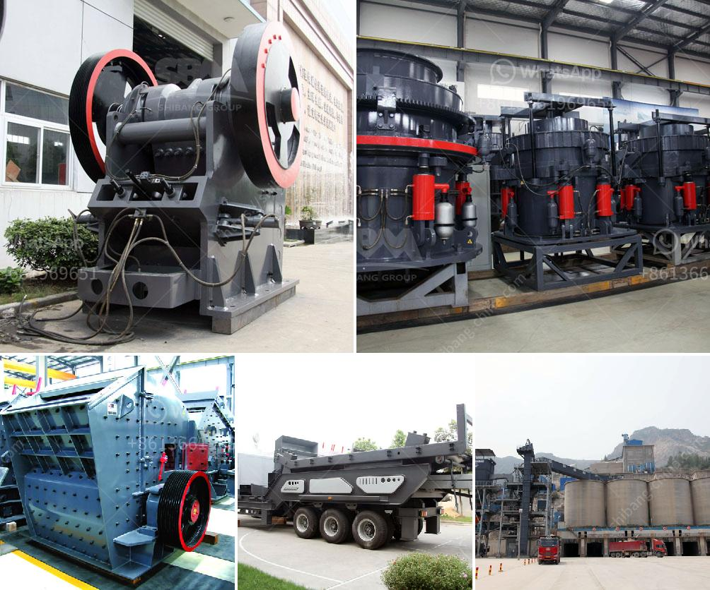

<h3>total cost of machinery of stone crusher</h3>
The stone crusher machinery is the special equipment for producing sand and stones in the stone production line. It is including jaw crusher, stone crusher, impact breaker, impact crusher, vibrating feeder, vibrating screen, sand washing machine, belt conveyor, etc. The general stone crushing plant production processes is: (bunker)-feeder-jaw crusher-impact crusher-vibrating screen-finished product. The machines can be connected by the belt conveyor.

Therefore, the total cost of machinery for a stone crusher plant is also affected by the regional differences, such as the price of steel, electrical power, and other local factors. The following is a brief analysis of the main factors influencing the total cost of the stone crusher machinery.

Firstly, the type and performance of the machine. The type of machine selected will also affect the cost of the stone crusher plant. The larger the capacity, the higher the price. Jaw crusher, cone crusher and impact crusher are the mainstream crushers used in mining industries. Jaw crusher and cone crusher are the classical laminated crushers, and also the most popular crushers, while impact crusher adopts impact crushing principle. In general, jaw crusher is used as the primary crusher, and cone crusher and impact crusher as the secondary. And they always combine with each other in the whole crushing line during the crushing process.

Secondly, the layout of the stone crusher machinery. Stone crusher plant layout mainly consists of jaw crusher, impact crusher, cone crusher and vibrating screen. These machines are connected by belt conveyor. The jaw crusher performs initial crushing, and the cone crusher and impact crusher break down the stone further and the sand making machine and sand washing machine constitute the secondary crushing process. Then, how do these machines work? In jaw crusher, the belt and belt pulley are driven by a motor, and the movable jaw moves up and down via eccentric shaft. The angle between fixed jaw and movable jaw becomes smaller when the moving jaw runs down, then the materials are crushed into pieces. It will become bigger when the movable jaw runs up. The movable jaw board leaves the fixed jaw board under the action of pole and spring, and then the end products come out from the crushing cavity. And also, jaw crusher is used as both primary jaw crusher and secondary jaw crusher.

Fourthly, the price of processed materials. For example, the price of iron ore is influenced by many factors, such as changes in supply and demand, exchange rates, import and export taxes, and so on. Therefore, when we design a stone crusher plant, we must conduct a comprehensive survey and analysis in advance. In addition, we should carefully calculate the cost according to the correct profit model. Contact experts to ensure the design and production of a stone crusher plant that meets specific production requirements.

To summarize, the total cost of a stone crusher plant depends on the type of machine, its capacity, the layout, and the material being processed. After evaluating the situation on-site, purchasing and installation costs, operating costs, and a number of other factors can be determined to be within a reasonable and balanced range. Achieving the maximum profitability with the minimum possible investment becomes possible through an optimized stone crusher plant.
<h3>Contact us</h3><ul><li><strong>Whatsapp:&nbsp;<a href="https://wa.me/8613661969651">+8613661969651</a></strong></li><li><a href="https://swt.shibang-china.com/?git&amp;zhl&amp;total cost of machinery of stone crusher"><strong>Online Service(chat now)</strong></a></li></ul><h3>Related</h3><ul><li><a href='cameroon quarry crusher.md'>cameroon quarry crusher</a></li><li><a href='small limestone plant.md'>small limestone plant</a></li><li><a href='power draw calculator of ball mill.md'>power draw calculator of ball mill</a></li><li><a href='iron ore crusher in pakistan.md'>iron ore crusher in pakistan</a></li><li><a href='mobile crusher machine price.md'>mobile crusher machine price</a></li></ul>