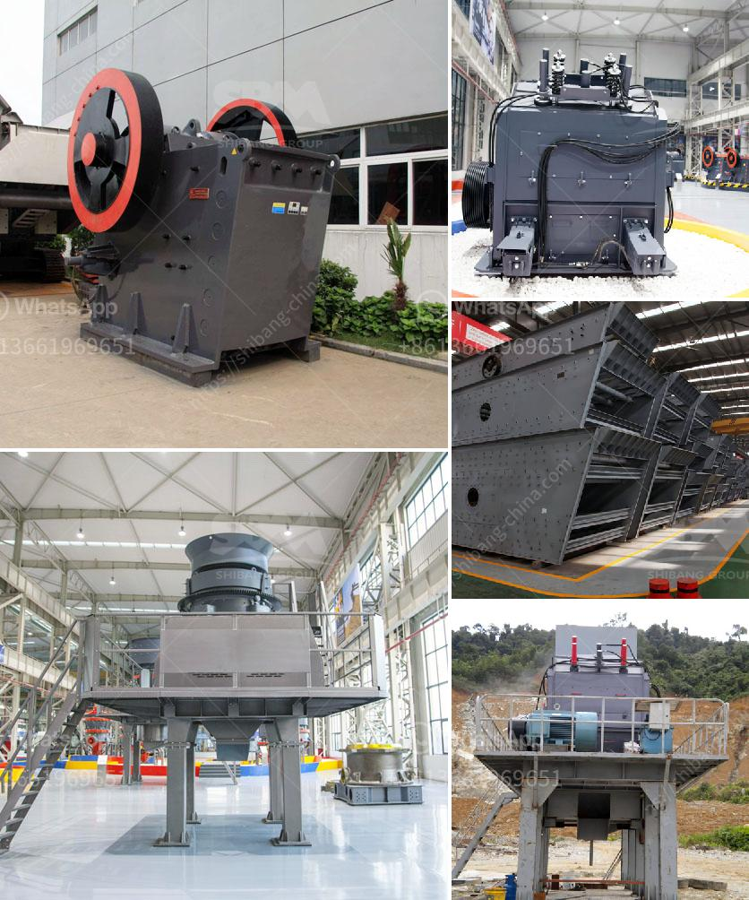

<h3>total process of gypsum powder plant</h3>
Gypsum powder, also known as plaster of Paris, is a white, powdery mineral used in various industries such as construction, medicine, food, and agriculture. It is made primarily from calcium sulfate dihydrate, obtained by heating gypsum stone. The process of producing gypsum powder involves several steps, including mining, crushing, grinding, calcination, and packaging.

The first step in the gypsum powder manufacturing process is mining. Typically, gypsum ore is mined in large open-pit quarries. The extracted rock is then transported to the crushing plant where it is crushed into smaller pieces of approximately 20 mm in size.

Next, the crushed gypsum is further ground into a fine powder in a grinding mill. The resulting powder, referred to as gypsum rock flour, is then heated at high temperatures through a process called calcination. During calcination, the gypsum is heated to remove the water molecules, resulting in the formation of calcium sulfate hemihydrate, also known as plaster of Paris.

After calcination, the plaster of Paris is cooled and then sent to a packaging unit. Here, the powdered gypsum is packaged in bags or bulk containers for distribution to various industries. The packaging process ensures that the gypsum powder remains free-flowing and does not clump together, ensuring its usability in different applications.

Gypsum powder is widely used in the construction industry as a building material, mainly for interior wall and ceiling applications. It is also used in agriculture as a soil conditioner, in food as a coagulant, and in medicine as a dental mold material. Its versatile properties make it an essential ingredient in various products.

In conclusion, the total process of a gypsum powder plant involves mining, crushing, grinding, calcination, and packaging. Each step is crucial in obtaining high-quality gypsum powder that meets the specific requirements of various industries. Gypsum powder plays a vital role in different applications, contributing to the overall development and progress in various sectors.
<h3>Contact us</h3><ul><li><strong>Whatsapp:&nbsp;<a href="https://wa.me/8613661969651">+8613661969651</a></strong></li><li><a href="https://swt.shibang-china.com/?git&amp;zhl&amp;total process of gypsum powder plant"><strong>Online Service(chat now)</strong></a></li></ul><h3>Related</h3><ul><li><a href='mobile stone crusher plant on hire in india.md'>mobile stone crusher plant on hire in india</a></li><li><a href='grinding mill machine roller mill size.md'>grinding mill machine roller mill size</a></li><li><a href='tonne ball mill.md'>tonne ball mill</a></li><li><a href='fairly used quarry crusher in nigeria price.md'>fairly used quarry crusher in nigeria price</a></li><li><a href='hammer mill zimbabwe.md'>hammer mill zimbabwe</a></li></ul>