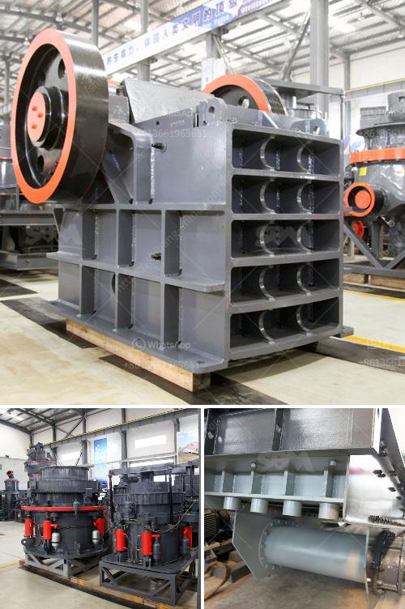

<h3>tph stationery stone crushing plant</h3>
Quarries and crushing plants have been an integral part of the construction industry for decades. The widespread use of stone aggregates in structures is essential to meet the growing infrastructure needs worldwide. However, the process of crushing rocks and extracting aggregates is not without environmental impacts.

Enter the TPH Stationary Stone Crushing Plant. This innovative solution is designed to minimize the environmental impact and ensure sustainable practices in quarry operations. With high productivity and low energy consumption, this plant is capable of producing high-quality aggregates efficiently.

One of the primary advantages of the TPH stationary stone crushing plant is its reliability. It requires minimal maintenance and offers reliable operation throughout its lifetime. This plant is built to last, making it a cost-effective investment for quarry owners. Additionally, the stationary nature of the plant ensures a consistent output, allowing businesses to plan their operations effectively.

In terms of crushing capacity, the TPH stationary stone crushing plant comprises a jaw crusher, cone crusher, portable rock crusher, impact crusher, and a vibrating feeder. All these machines collaborate to break down large pieces of rock into smaller ones of desired size. Commonly used in quarry operations, the plant can produce aggregates of various sizes, ensuring flexibility for different construction applications.

Energy efficiency is a key consideration in the design of the TPH stationary stone crushing plant. By utilizing advanced technologies, the plant minimizes energy consumption without compromising on productivity. The use of automated controls and efficient motors also contributes to reduced operational costs and environmental impact.

Furthermore, the TPH stationary stone crushing plant is designed to be environmentally friendly. It incorporates various measures to mitigate dust, noise, and other emissions associated with quarry operations. For instance, dust control systems are integrated into the plant's design to suppress dust generation and improve air quality in the vicinity. Noise reduction features ensure compliance with strict noise regulations, minimizing disturbance to nearby communities.

In addition to its environmental benefits, the TPH stationary stone crushing plant also offers social and economic advantages. This plant can generate employment opportunities in the local community, fostering economic development. Furthermore, by producing high-quality aggregates, it supports the construction industry's need for sustainable materials, enhancing the durability and longevity of structures.

As quarry operations face increasing scrutiny and regulatory requirements, the TPH stationary stone crushing plant proves to be an ideal solution. By embracing the principles of sustainability and incorporating advanced technologies, this plant offers a responsible and reliable approach to stone crushing. Quarry owners can look forward to lower operating costs, reduced environmental impact, and enhanced community relations with the adoption of this innovative solution.

In conclusion, the TPH stationary stone crushing plant is a sustainable and environmentally friendly solution for quarry operations. It combines reliability, energy efficiency, and social responsibility to support the construction industry's growing demand for stone aggregates. With its advanced technologies and low environmental impact, this plant ensures a sustainable future for the quarrying sector.
<h3>Contact us</h3><ul><li><strong>Whatsapp:&nbsp;<a href="https://wa.me/8613661969651">+8613661969651</a></strong></li><li><a href="https://swt.shibang-china.com/?git&amp;zhl&amp;tph stationery stone crushing plant"><strong>Online Service(chat now)</strong></a></li></ul><h3>Related</h3><ul><li><a href='grinding mill machine roller mill size.md'>grinding mill machine roller mill size</a></li><li><a href='machines de crushine primaires.md'>machines de crushine primaires</a></li><li><a href='jaw crusher supplier in jakarta.md'>jaw crusher supplier in jakarta</a></li><li><a href='used stone crushers for sale from uae.md'>used stone crushers for sale from uae</a></li><li><a href='jual mesin limestone crusher.md'>jual mesin limestone crusher</a></li></ul>