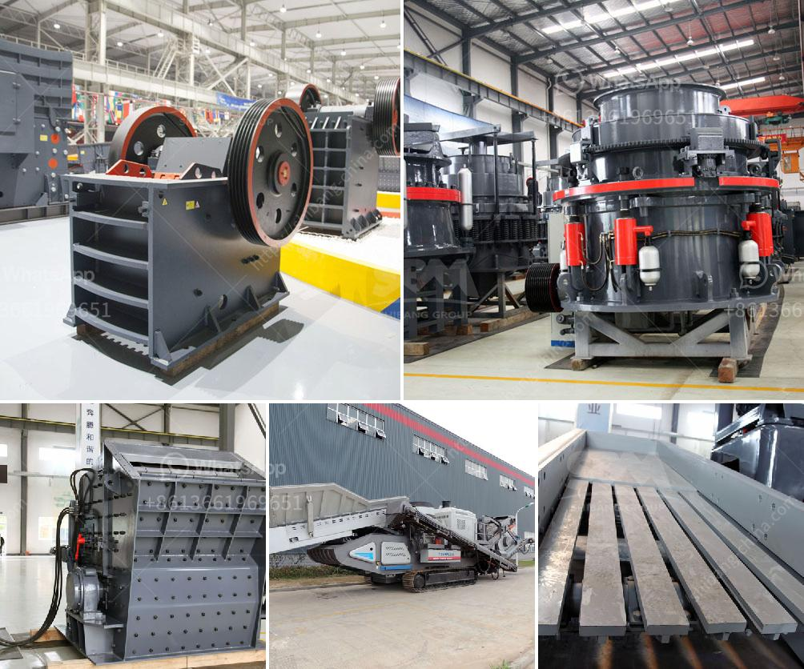

<h3>trommel screen capacity calculation</h3>
The trommel screen is a type of screening equipment used to separate materials into different sizes. It is commonly used in industries such as mining and construction to separate fines from coarse materials. One of the key factors in determining the efficiency of a trommel screen is its capacity.

The capacity of a trommel screen is measured in cubic meters per hour (m³/h) or tons per hour (t/h). The calculation method based on the throughput of the trommel screen is as follows:

The screening area is calculated by multiplying the length of the drum (L) by the width of the drum (W). The screening area is also affected by the inclination angle of the drum and the rotational speed of the drum. The higher the inclination angle and the higher the rotational speed, the larger the screening area.

To calculate the screening volume, multiply the screening area by the depth of the material on the screen. The depth of the material can vary depending on the size of the particles and the moisture content. It is important to consider the maximum depth of the material that the trommel screen can handle without overflow.

The screening efficiency is the ratio of the amount of material that passes through the screen to the total amount of material in the feed. It is affected by factors such as the size and shape of the particles, the moisture content, and the angle of inclination of the drum.

The capacity is calculated by multiplying the screening volume by the screening efficiency, which is expressed as a decimal. For example, if the screening volume is 0.9 m³ and the screening efficiency is 75%, the capacity of the trommel screen is 0.9 m³ x 0.75 = 0.675 m³/h or 0.675 t/h.

It is important to note that the capacity of a trommel screen is not constant and can vary depending on several factors. These factors include the type and size of the materials being screened, the moisture content, the angle of inclination of the drum, and the rotational speed of the drum. It is recommended to conduct regular tests and adjustments to optimize the capacity of the trommel screen.

In conclusion, calculating the capacity of a trommel screen is an essential step in designing and operating the equipment efficiently. By considering factors such as the screening area, screening volume, and screening efficiency, the capacity can be accurately estimated. It is important to keep in mind that the capacity can vary depending on various factors, and regular monitoring and adjustments are necessary to optimize performance.
<h3>Contact us</h3><ul><li><strong>Whatsapp:&nbsp;<a href="https://wa.me/8613661969651">+8613661969651</a></strong></li><li><a href="https://swt.shibang-china.com/?git&amp;zhl&amp;trommel screen capacity calculation"><strong>Online Service(chat now)</strong></a></li></ul><h3>Related</h3><ul><li><a href='cement clinker processing plant.md'>cement clinker processing plant</a></li><li><a href='crushing machines in bolivia.md'>crushing machines in bolivia</a></li><li><a href='feldspar ball mill porcess.md'>feldspar ball mill porcess</a></li><li><a href='trommel screen capacity calculation.md'>trommel screen capacity calculation</a></li><li><a href='mining equipment cad blocks.md'>mining equipment cad blocks</a></li></ul>