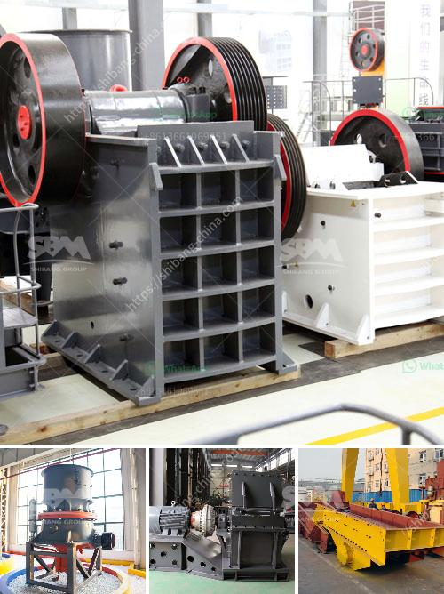

<h3>trommel small mobile wash plants for sale</h3>
Small-scale gold mining has become one of the most lucrative industries on the planet. Unfortunately, many of these operations tend to use mercury as a means of extracting gold, which is not only harmful to the environment but also poses a health risk to the miners involved. In recent years, the industry has seen a shift towards more environmentally friendly practices, with the use of trommel small mobile wash plants gaining traction.

Trommel small mobile wash plants are portable and efficient gold recovery machines designed specifically for small-scale mining operations. These plants utilize rotating drums or screens to separate valuable materials from the surrounding gravel. With the ability to process up to several tons of material per hour, these wash plants are ideal for processing high-grade deposits.

The primary advantage of trommel small mobile wash plants is their mobility. Unlike large-scale wash plants, which require extensive setup and infrastructure, these portable units can be easily transported to any location. This makes them extremely versatile, allowing miners to bring the processing unit directly to the source of their deposit, saving time and money.

Additionally, these wash plants are designed with simplicity in mind. They are easy to operate, with minimal training required. The process involves feeding the material into the rotating drum, while water and agitation ensure effective separation of gold particles. The washed gravel is then sluiced, with the gold settling into riffles or mats for collection.

Another key benefit of trommel small mobile wash plants is their cost-effectiveness. These units are significantly more affordable compared to large-scale wash plants, making them accessible to small-scale miners with limited resources. Furthermore, their modular design allows for future expansion or customization as mining operations grow.

In conclusion, trommel small mobile wash plants are revolutionizing small-scale gold mining by offering a portable and cost-effective solution that adheres to environmentally friendly practices. With the ability to process large volumes of material and with minimal setup requirements, these wash plants offer an efficient means of recovering gold while minimizing harm to the environment and the health of miners.
<h3>Contact us</h3><ul><li><strong>Whatsapp:&nbsp;<a href="https://wa.me/8613661969651">+8613661969651</a></strong></li><li><a href="https://swt.shibang-china.com/?git&amp;zhl&amp;trommel small mobile wash plants for sale"><strong>Online Service(chat now)</strong></a></li></ul><h3>Related</h3><ul><li><a href='double rollar mill.md'>double rollar mill</a></li><li><a href='gypsum powder making plant.md'>gypsum powder making plant</a></li><li><a href='stone crusher plant management.md'>stone crusher plant management</a></li><li><a href='crusher for rent in malaysia.md'>crusher for rent in malaysia</a></li><li><a href='operating parameter of vertical roller mill.md'>operating parameter of vertical roller mill</a></li></ul>