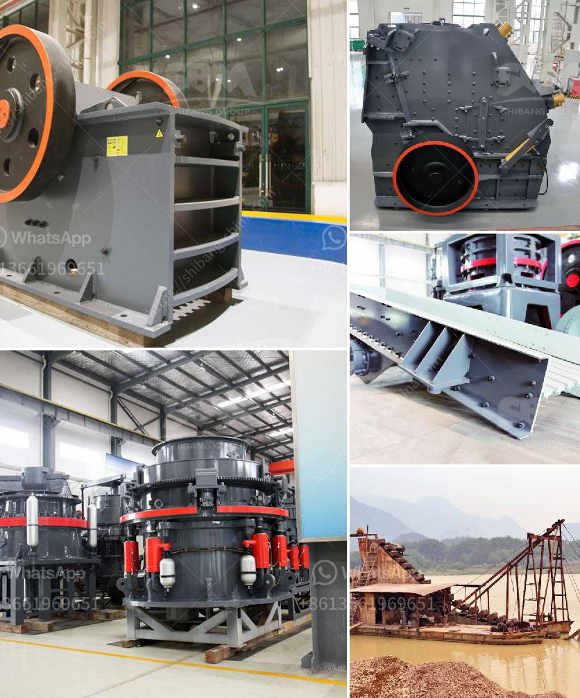

<h3>turnkey project for gypsum board manufacturing plant</h3>
Turnkey Project for Gypsum Board Manufacturing Plant: A Complete Solution for Successful Implementation

Gypsum board, also known as drywall or plasterboard, is a construction material used for walls and ceilings. It offers several advantages such as fire resistance, sound insulation, and easy installation, making it a popular choice in the construction industry. Hence, setting up a gypsum board manufacturing plant can be a lucrative business opportunity.

However, establishing a manufacturing plant for gypsum board requires systematic planning, technical expertise, and investment. This is where turnkey projects come into play. A turnkey project is an all-inclusive solution that takes care of every aspect of the project from inception to completion. It provides a hassle-free experience to the investors, ensuring a smooth and successful implementation of the manufacturing plant.

One of the key advantages of opting for a turnkey project for a gypsum board manufacturing plant is that it brings together various experts who specialize in different areas. These experts have extensive knowledge and experience in designing, engineering, procurement, construction, installation, and commissioning of gypsum board manufacturing plants. They work in close coordination to ensure that all the components of the project are seamlessly integrated.

The turnkey project begins with a detailed feasibility study, where the experts analyze various factors including market demand, raw material availability, manufacturing process, and financial viability. Based on the findings of the feasibility study, a comprehensive project report is prepared, which outlines the scope, budget, and timeline of the project.

Once the project report is approved, the experts kick-start the design and engineering phase. They carefully design the layout of the manufacturing plant, considering factors such as production capacity, storage requirements, and safety regulations. The plant is designed to maximize efficiency and minimize wastage.

After the design phase, the procurement stage begins. The turnkey project team ensures that the necessary machinery, equipment, and raw materials are procured from reliable and reputed suppliers. They negotiate contracts, supervise quality control, and manage logistics to ensure timely delivery of all the components.

Once all the necessary components are procured, the construction and installation phase begins. Skilled engineers and technicians are deployed to construct the plant infrastructure and install the machinery. The entire process is closely monitored to ensure adherence to safety standards and quality control.

Finally, the commissioning and operationalization phase takes place. This involves rigorous testing of the machinery, fine-tuning of the production processes, and training of the operators. The turnkey project team ensures that the plant is fully functional and optimized for production.

In conclusion, a turnkey project for a gypsum board manufacturing plant provides a holistic solution for investors. It eliminates the challenges and complexities associated with establishing a manufacturing plant and streamlines the entire process from start to finish. By choosing a turnkey project, investors can confidently venture into the gypsum board manufacturing business, knowing that they have a team of experts guiding them every step of the way.
<h3>Contact us</h3><ul><li><strong>Whatsapp:&nbsp;<a href="https://wa.me/8613661969651">+8613661969651</a></strong></li><li><a href="https://swt.shibang-china.com/?git&amp;zhl&amp;turnkey project for gypsum board manufacturing plant"><strong>Online Service(chat now)</strong></a></li></ul><h3>Related</h3><ul><li><a href='steel slag recycling plant.md'>steel slag recycling plant</a></li><li><a href='european stone crusher.md'>european stone crusher</a></li><li><a href='copper ore concentration processing.md'>copper ore concentration processing</a></li><li><a href='iron ore process crushing.md'>iron ore process crushing</a></li><li><a href='machine powder gypsum mill.md'>machine powder gypsum mill</a></li></ul>