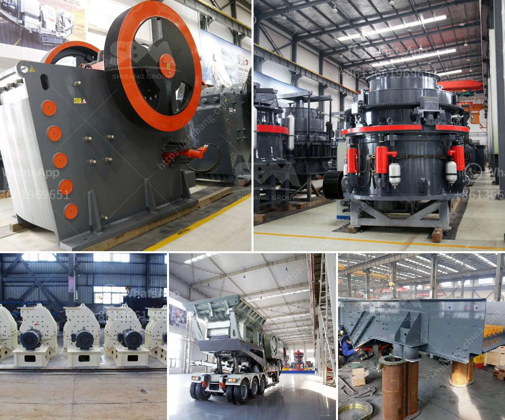

<h3>two roll mill machine</h3>
The two roll mill machine is a commonly used piece of equipment in the manufacturing industries. It enables manufacturers to produce a wide range of products such as rubber compounds, plastic materials, fiber composites, and PVC compounds. From the initial blending and mixing of ingredients to the final shaping and refining of the material, the two roll mill machine plays a crucial role in ensuring the quality and consistency of the end product.

The two roll mill machine consists of two horizontally arranged parallel rolls that rotate in opposite directions at varying speeds. This design allows for precise control over the mixing process, facilitating efficient and uniform blending of ingredients. The rolls are typically made of high-quality alloy steel or stainless steel, ensuring durability, high resistance to wear, and the ability to withstand high temperatures and pressures.

With its versatile design, the two roll mill machine is widely used in various industries. In the rubber industry, it is used for processing rubber compounds and creating rubber sheets, strips, and slabs. The machine helps to homogenize the rubber compound, ensuring consistent properties such as tensile strength, elongation, and hardness.

For plastic materials, the two roll mill machine is invaluable in the production of thermoplastics and thermosetting plastics. It enables manufacturers to melt and blend polymers, additives, and fillers to create a uniform mixture that can be processed further into various products like extruded profiles, sheets, or injection-molded parts.

In the composite material industry, the two roll mill machine is extensively used for processing fiber-reinforced materials. The machine enables the effective dispersion of the fibers within the matrix, ensuring a uniform distribution and alignment that enhances the mechanical properties of the final composite product. This is particularly important in industries such as aerospace, automotive, and construction, where the performance and durability of the composite materials are crucial.

Another area where the two roll mill machine is widely employed is in the production of PVC compounds. PVC, or polyvinyl chloride, is a versatile material used in numerous applications, including building materials, packaging, and medical products. The machine allows for the homogeneous blending of PVC resins and additives, ensuring consistent properties and making it easier to process the compound into the desired form, such as pipes, tubes, or profiles.

Overall, the two roll mill machine is a highly efficient and versatile workhorse that offers numerous benefits for various manufacturing industries. Its ability to blend, mix, refine, and shape a wide range of materials is crucial in achieving consistent product quality, improving productivity, and reducing manufacturing costs. As advancements in technology continue to enhance the capabilities and functionalities of the two roll mill machine, it is set to remain an indispensable tool for manufacturers across different sectors.
<h3>Contact us</h3><ul><li><strong>Whatsapp:&nbsp;<a href="https://wa.me/8613661969651">+8613661969651</a></strong></li><li><a href="https://swt.shibang-china.com/?git&amp;zhl&amp;two roll mill machine"><strong>Online Service(chat now)</strong></a></li></ul><h3>Related</h3><ul><li><a href='mining equipment seller in asia.md'>mining equipment seller in asia</a></li><li><a href='mini rock crusher manufacturer in china.md'>mini rock crusher manufacturer in china</a></li><li><a href='ball mill mesh size.md'>ball mill mesh size</a></li><li><a href='mini jaw crusher for sale used.md'>mini jaw crusher for sale used</a></li><li><a href='ball mill 3 ton.md'>ball mill 3 ton</a></li></ul>