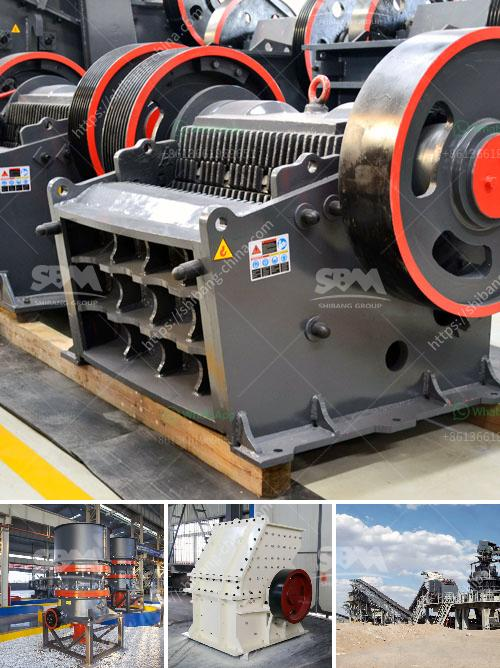

<h3>types of aggregate crushers pdf</h3>
Aggregates are essential materials in construction, as they provide the necessary strength and durability to various structures. To obtain high-quality aggregates, the use of appropriate crushers is crucial. There are different types of aggregate crushers that serve unique purposes. In this article, we will explore some of the most commonly used crushers in the industry.

Jaw crushers are primarily used for coarse crushing. As the name suggests, these crushers operate by applying pressure to the material, breaking it into smaller pieces. The crushed material is often used as a base or sub-base for various construction projects. Jaw crushers can handle a wide range of materials, including concrete, gravel, and limestone.

Gyratory crushers are similar to jaw crushers in terms of the crushing principle but differ in their design. These crushers have a conical-shaped head that gyrates inside a chamber, crushing the material against the walls of the chamber. Gyratory crushers are commonly used for primary crushing applications, especially in the mining industry.

Cone crushers are versatile machines that can be used in various stages of the crushing process. They are commonly used in secondary, tertiary, and quaternary crushing stages. Cone crushers are known for their efficiency and high crushing capacity. They can crush both hard and soft materials, making them suitable for a wide range of applications.

Impact crushers utilize impact forces to crush materials. They are widely used in the construction industry, particularly for crushing rocks, concrete, and asphalt. These crushers can be either horizontal shaft impactors (HSIs) or vertical shaft impactors (VSIs). HSIs are suitable for softer materials, while VSIs are more suitable for hard and abrasive materials.

Hammer mills are crushers that use rotating hammers to break down materials. They are mainly used for small-scale applications, such as crushing coal or limestone. Hammer mills are very simple machines compared to other crushers, which makes them easy to operate and maintain.

Roll crushers are used for primary or secondary crushing applications. They consist of two cylinders that rotate in opposite directions, crushing the material between them. Roll crushers are commonly used for breaking down hard and abrasive materials, such as ores and minerals.

In summary, there are various types of aggregate crushers used in the construction industry, each catering to specific needs. Jaw crushers are ideal for coarse crushing, gyratory crushers are suitable for primary crushing, cone crushers are versatile machines for various crushing stages, impact crushers are suitable for crushing rocks and concrete, hammer mills are simple machines for small-scale applications, and roll crushers are designed for breaking down hard and abrasive materials.

Before choosing a crusher, it is essential to consider factors such as the material properties, required capacity, and desired product size. By selecting the right type of crusher, construction professionals can ensure the production of high-quality aggregates that meet the specific project requirements.
<h3>Contact us</h3><ul><li><strong>Whatsapp:&nbsp;<a href="https://wa.me/8613661969651">+8613661969651</a></strong></li><li><a href="https://swt.shibang-china.com/?git&amp;zhl&amp;types of aggregate crushers pdf"><strong>Online Service(chat now)</strong></a></li></ul><h3>Related</h3><ul><li><a href='chrome washing machine plant eluvial mill gold.md'>chrome washing machine plant eluvial mill gold</a></li><li><a href='ball mill diagram manufacturers in bangalore.md'>ball mill diagram manufacturers in bangalore</a></li><li><a href='rock crusher pulverizer.md'>rock crusher pulverizer</a></li><li><a href='station mobile de lavage de diamants.md'>station mobile de lavage de diamants</a></li><li><a href='mining equipment cad blocks.md'>mining equipment cad blocks</a></li></ul>