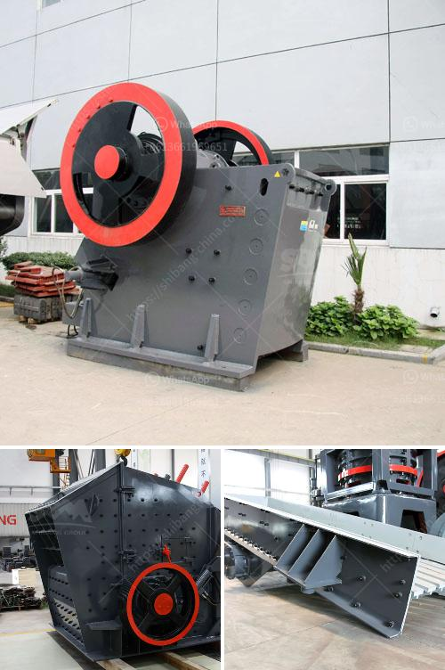

<h3>types of coal crusher</h3>
Coal, a combustible black or brownish-black sedimentary rock, is composed mainly of carbon along with various other elements such as hydrogen, sulfur, oxygen, and nitrogen. Coal is extracted from the ground through mining, either underground or open-pit. It is then processed to separate impurities and create a uniform size for commercial use. One of the crucial processes in this coal preparation is the crushing stage. So, choosing a suitable coal crusher machine is vital.

In this article, we will discuss the different types of coal crushers and highlight their uses and benefits.

Jaw crushers are mainly used as primary crushers. They are a popular choice for the crushing of ores and various hard materials such as coal. This is due to their ability to handle large feed sizes and produce a consistent product size. Moreover, jaw crushers are hydraulically operated, which provides a reliable and efficient crushing process.

Gyratory crushers are commonly used for primary crushing in coal processing plants. They are characterized by a gyrating mantle within a concave bowl, which provides a higher production rate and a more uniform product size. However, gyratory crushers have a higher initial cost and require a larger infrastructure to support them.

Cone crushers are a type of compression crusher used by coal plants to crush rock or other materials by using a mantle and a bowl-shaped cavity that rotates under the compression force of the mantle. This makes them ideal for secondary and tertiary crushing stages in coal processing.

Impact crushers utilize impact energy to crush coal particles. This mechanical pressure is achieved by the two jaws of the crusher of which one is fixed while the other reciprocates. Impact crushers offer significant advantages, such as a high crushing ratio, cubic finished product, and uniform particle size.

Hammer crushers are used either as a one-step primary crusher or as a secondary crusher for products from a primary crusher. They are widely used for crushing hard and abrasive materials in both the aggregate and mining industries.

Overall, choosing the right type of crusher plays a crucial role in the efficiency and quality of the coal preparation process. Each type of crusher has its own benefits and limitations, so it is important to evaluate different factors when making a selection. These factors include the feed size, desired product size, capacity requirements, and operational costs. By considering these factors, coal processing plants can make an informed decision and optimize their processes for maximum productivity.
<h3>Contact us</h3><ul><li><strong>Whatsapp:&nbsp;<a href="https://wa.me/8613661969651">+8613661969651</a></strong></li><li><a href="https://swt.shibang-china.com/?git&amp;zhl&amp;types of coal crusher"><strong>Online Service(chat now)</strong></a></li></ul><h3>Related</h3><ul><li><a href='how to start mining business in india.md'>how to start mining business in india</a></li><li><a href='mobile crushing plants usa.md'>mobile crushing plants usa</a></li><li><a href='alluvial chrome wash plant.md'>alluvial chrome wash plant</a></li><li><a href='used cone crushers zambia.md'>used cone crushers zambia</a></li><li><a href='green rock quarry in sariaya.md'>green rock quarry in sariaya</a></li></ul>