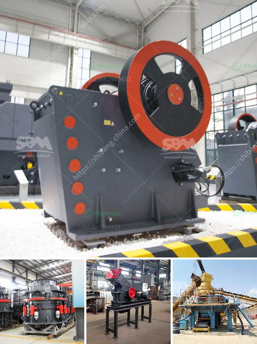

<h3>types of crusher for ore processing</h3>
Crushers are machines that reduce the size of rocks, minerals, and ore in various industrial sectors such as mineral processing, cement production, and construction industries. These ore-processing machines take advantage of the material properties that can be subjected to a certain force to reduce the size of the ore. Different crushers are used depending on the type of material you're trying to crush.

1. Jaw Crusher: A jaw crusher is a type of crusher comprised of two jaw plates. One is a fixed jaw plate, and the other is a movable jaw plate, which allows the two plates to crush materials by an eccentric movement. The jaw crusher is recommended for primary crushing of ores, making it a necessary coarse crushing machine for any ore processing facility.

2. Cone Crusher: Cone crushers are popular rock crushing machines in aggregates production, mining operations, and recycling applications. They are normally used in secondary, tertiary, and quaternary crushing stages. However, in ore processing, cone crushers are often used for intermediate and fine crushing, and sometimes for primary crushing if they have the necessary features for that application.

3. Impact Crusher: An impact crusher utilizes the impact force to crush materials. This type of crusher is comprised of a rotor with a blow bar(s) spinning at high speed to deliver a high-energy impact to the material. It is commonly utilized in ore processing for both primary and secondary crushing stages.

4. Gyratory Crusher: A gyratory crusher is another commonly used crushing machine in ore processing. It features a conical-shaped crushing head and an inclined, serrated surface. The working principle of a gyratory crusher is based on the compression and squeezing forces between the fixed concave liner and the rotating mantle. Gyratory crushers are suitable for primary crushing, usually in large-scale ore processing plants.

5. Roll Crusher: A roll crusher is a secondary type of crusher used in ore processing. Roll crushers rely on a combination of compression forces generated by two counter-rotating rolls, impacting forces pressing the material between them. They are primarily used for coal and harder rock ores. Roll crushers can be either smooth or toothed, offering different advantages depending on the application.

6. Hammer Crusher: Hammer crushers use rotating hammer-like hammers to impact the material and break it into smaller pieces. They are primarily used in the construction and mineral processing industries for soft to medium-hard materials. Hammer crushers can be used in both primary and secondary crushing stages.

7. Vertical Shaft Impact Crusher (VSI): VSI crushers are predominantly employed in the production of high-quality manufactured sand and fine crushers for the shaping of aggregates in the construction and mining industries. They have a vertical spindle with a rotor that moves materials against the anvils or rock shelves for crushing.

In conclusion, there are various types of crushers available for ore processing, each with its specific application. The suitable crusher for a particular ore depends on the type of material, size, hardness, and desired final product size. Understanding the different types of crushers and their applications can help you choose the most appropriate machine for your ore processing needs.
<h3>Contact us</h3><ul><li><strong>Whatsapp:&nbsp;<a href="https://wa.me/8613661969651">+8613661969651</a></strong></li><li><a href="https://swt.shibang-china.com/?git&amp;zhl&amp;types of crusher for ore processing"><strong>Online Service(chat now)</strong></a></li></ul><h3>Related</h3><ul><li><a href='hammer mill in china.md'>hammer mill in china</a></li><li><a href='sand washer machine.md'>sand washer machine</a></li><li><a href='small slag crushing plant manufacturers in delhi.md'>small slag crushing plant manufacturers in delhi</a></li><li><a href='components of a roller mill.md'>components of a roller mill</a></li><li><a href='ballast crushers cost.md'>ballast crushers cost</a></li></ul>