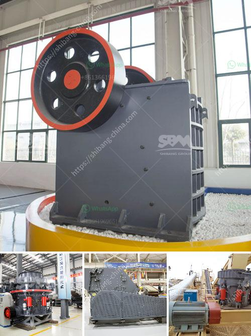

<h3>types of limestone screening</h3>
Limestone screening is a versatile material that is commonly used for various landscaping purposes. While it is primarily used for garden beds and walkways, limestone screening can also be incorporated into patio designs and driveways. With its natural beauty and endless possibilities, it’s no wonder that limestone screening is a popular choice among homeowners and landscapers.

There are several types of limestone screening available in the market, each with its own unique characteristics and applications. Understanding the different types can help you make an informed decision when choosing the most suitable option for your landscaping needs. Here are some of the most common types of limestone screening:

1. Agricultural Lime: Also known as aglime, this type of limestone screening is primarily used to improve the soil’s pH level and enhance its fertility. It contains a high concentration of calcium carbonate, which helps balance the soil’s acidity. Agricultural lime is often applied to large fields and farmlands to promote healthy plant growth and maximize crop production.

2. Masonry Sand: This is a finely crushed form of limestone screening that is commonly used as a base material for interlocking brick or stone patios and walkways. The small size and smooth texture of masonry sand make it ideal for filling gaps between pavers and preventing weed growth. It also provides a solid foundation, ensuring the durability and stability of the hardscape feature.

3. Beach Sand: As the name suggests, this type of limestone screening is commonly used for creating sandy beach areas and sandboxes. It is finer in texture compared to masonry sand and has a natural golden color. Beach sand is clean, safe, and easy to work with, making it a popular choice for children’s play areas and decorative landscaping projects.

4. Bedding Sand: This type of limestone screening is primarily used for setting paving stones and retaining wall blocks. It acts as a base material, providing a level and stable surface for the installation of these hardscape elements. Bedding sand is coarse in texture and drains well, ensuring proper water filtration and preventing pooling or erosion.

5. Filter Stone: As the name implies, filter stone is used for filtration purposes and is commonly used in water treatment systems and drainage applications. This type of limestone screening has a uniform size and shape, allowing water to pass through while keeping out debris and sediments. Filter stone is typically placed in trenches or underground pipes to facilitate proper water flow and prevent blockages.

When selecting the most suitable type of limestone screening for your project, it is crucial to consider factors such as the intended use, climate conditions, and aesthetic preferences. It is recommended to consult with a professional landscaper or supplier who can provide expert advice on the best option for your specific requirements.

In conclusion, limestone screening offers a wide range of applications in landscaping projects. Whether you need to improve soil fertility, create a stable foundation, or enhance the visual appeal of your outdoor space, there is a type of limestone screening that can meet your needs. By understanding the different types available and their specific uses, you can confidently select the ideal material for your landscaping project and achieve the desired results.
<h3>Contact us</h3><ul><li><strong>Whatsapp:&nbsp;<a href="https://wa.me/8613661969651">+8613661969651</a></strong></li><li><a href="https://swt.shibang-china.com/?git&amp;zhl&amp;types of limestone screening"><strong>Online Service(chat now)</strong></a></li></ul><h3>Related</h3><ul><li><a href='machinery for copper plant.md'>machinery for copper plant</a></li><li><a href='old impact crushing plant for sale.md'>old impact crushing plant for sale</a></li><li><a href='mica minerals powder grinding unit in kenya.md'>mica minerals powder grinding unit in kenya</a></li><li><a href='cement clinker processing plant.md'>cement clinker processing plant</a></li><li><a href='small scale gold mill from china.md'>small scale gold mill from china</a></li></ul>