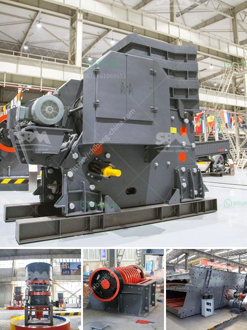

<h3>types of roller mill</h3>
A roller mill is a type of agricultural equipment used to crush or grind grains into powder. It typically consists of two large cast-iron or steel rollers that revolve around each other and compress the grains between them. There are several different types of roller mills that are commonly used in agriculture, each with its unique advantages and applications.

The first type of roller mill is the two-high roller mill. This mill, as the name suggests, features two rollers placed horizontally on top of each other. The grain is fed into the space between the rollers, and as they rotate, it is crushed or ground into smaller particles. Two-high roller mills are commonly used for crushing grains such as corn, wheat, rice, and barley, and can be used in both small-scale and large-scale operations.

The second type of roller mill is the three-high roller mill. This mill has three rollers instead of two, and they are placed vertically on top of each other. The grain is fed into the top roller, which is then passed through the middle roller and finally the bottom roller. The three-high roller mill is often used for crushing harder grains such as oats or malted barley, and is particularly suited to brewing and distilling operations. Its vertical design allows for more precise control over the crushing process, resulting in a more consistent and higher-quality end product.

The third type of roller mill is the PTO-driven roller mill. This type of mill is powered by a power take-off (PTO) from a tractor or other agricultural vehicle. It is commonly used in rural areas where electricity may be limited or unavailable. PTO-driven roller mills are versatile and can be used for a wide range of applications, from crushing grains for animal feed to grinding cornmeal for baking. They are typically smaller and more portable than other types of roller mills, making them ideal for on-site milling or small-scale farming operations.

Another type of roller mill is the hammer mill, which is essentially a roller mill with hammers attached to the rotating drum. As the grain is fed into the mill, the hammers crush and pulverize it into smaller particles. Hammer mills are versatile machines that can be used for a variety of applications, such as crushing grains, grinding spices, or shredding paper. They are commonly used in the agricultural and food processing industries.

In conclusion, roller mills are a vital piece of equipment in the agricultural industry. They are used to crush or grind grains into powder, making them easier to handle and process. There are several different types of roller mills, including two-high, three-high, PTO-driven, and hammer mills, each with its advantages and applications. Whether for animal feed production, brewing, or other agricultural uses, roller mills are essential in improving efficiency and producing high-quality products.
<h3>Contact us</h3><ul><li><strong>Whatsapp:&nbsp;<a href="https://wa.me/8613661969651">+8613661969651</a></strong></li><li><a href="https://swt.shibang-china.com/?git&amp;zhl&amp;types of roller mill"><strong>Online Service(chat now)</strong></a></li></ul><h3>Related</h3><ul><li><a href='model of raymound roller mill.md'>model of raymound roller mill</a></li><li><a href='gypsum board manufacturing machine india.md'>gypsum board manufacturing machine india</a></li><li><a href='how to grind mica for powder in small scale.md'>how to grind mica for powder in small scale</a></li><li><a href='primary impact crusher disadvantages.md'>primary impact crusher disadvantages</a></li><li><a href='machine de fabrication de sable de platre.md'>machine de fabrication de sable de platre</a></li></ul>