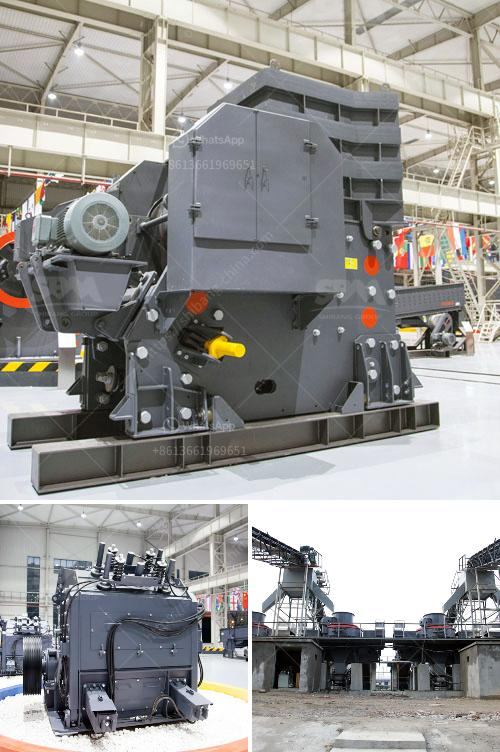

<h3>ultra fine calcium carbonate powder production equipment</h3>
Ultra fine calcium carbonate powder is a commonly used modifier in various industrial applications. It is a mineral that comes in different particle sizes, which determine its functionality in different industries. The smaller the particle size, the higher the surface area and the better the dispersibility. Therefore, the production of ultra fine calcium carbonate powder requires dedicated equipment to achieve the desired particle size and quality.

One of the main equipment used in the production of ultra fine calcium carbonate powder is a mechanical pulverizer. This machine grinds the raw materials into a fine powder of the desired particle size. The pulverizer consists of a rotating drum with grinding rods or balls that crush the materials against its inner surface. The speed and size of the grinding media can be adjusted to obtain the desired particle size.

Once the raw materials are ground into a fine powder, they are then classified using air classifiers. These classifiers use air flow and sieving to separate particles of different sizes. The ultra fine calcium carbonate powder is collected at the bottom while the larger particles are sent back to the pulverizer for further grinding. This process is repeated until the desired particle size is achieved.

To improve the quality of the ultra fine calcium carbonate powder, the production equipment may include other components such as separators and filters. These components help remove impurities and ensure the purity of the final product. They can also control the particle size distribution and improve the flowability of the powder, making it easier to handle and process in different applications.

The production of ultra fine calcium carbonate powder requires careful monitoring and control of various parameters such as grinding time, speed, temperature, and airflow. These parameters can affect the particle size, quality, and production efficiency of the powder. Therefore, advanced monitoring and control systems are often integrated into the production equipment to ensure consistent and reliable results.

There are different types of ultra fine calcium carbonate powder production equipment available in the market. Some manufacturers offer complete turnkey solutions that include all the necessary equipment and control systems. Others provide modular systems that can be customized and configured according to specific requirements.

In conclusion, the production of ultra fine calcium carbonate powder requires specialized equipment to achieve the desired particle size and quality. Mechanical pulverizers, air classifiers, and other components are used to grind, classify, and purify the raw materials. Advanced monitoring and control systems ensure consistent and reliable results. With the right equipment, manufacturers can produce ultra fine calcium carbonate powder that meets the stringent requirements of various industries.
<h3>Contact us</h3><ul><li><strong>Whatsapp:&nbsp;<a href="https://wa.me/8613661969651">+8613661969651</a></strong></li><li><a href="https://swt.shibang-china.com/?git&amp;zhl&amp;ultra fine calcium carbonate powder production equipment"><strong>Online Service(chat now)</strong></a></li></ul><h3>Related</h3><ul><li><a href='ball mill mesh size.md'>ball mill mesh size</a></li><li><a href='price of industrial crusher in nigeria.md'>price of industrial crusher in nigeria</a></li><li><a href='crusher gravel crusher gravel crusher price.md'>crusher gravel crusher gravel crusher price</a></li><li><a href='granite crushing per tonne.md'>granite crushing per tonne</a></li><li><a href='rolling mill raw material.md'>rolling mill raw material</a></li></ul>