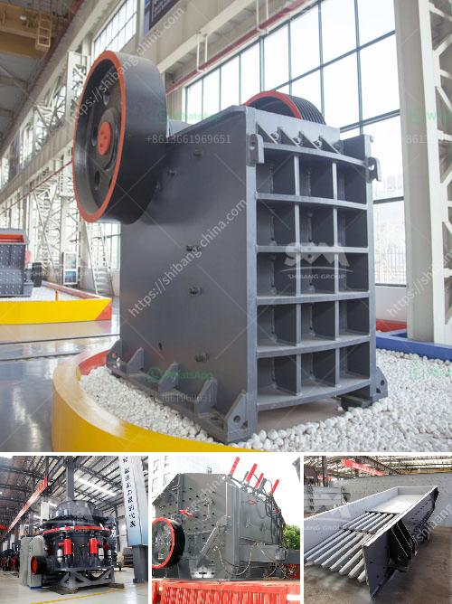

<h3>ultra fine mill price</h3>
The ultra fine mill is a common milling machine used in industrial production. Compared with the traditional milling equipment, its performance is more superior and stable. With the continuous improvement of technology, the ultra fine mill has also been upgraded and optimized to bring customers a better milling experience. However, one of the key factors that customers pay attention to is the price of the ultra fine mill.

When it comes to the price of the ultra fine mill, it is influenced by various factors. Firstly, the brand and reputation of the manufacturer have a significant impact on the price. A well-known manufacturer with a good reputation may offer a higher price, but customers can be assured of the quality and after-sales service. On the other hand, some smaller or unknown manufacturers may offer a lower price, but the quality and service may be a concern.

Secondly, the specifications and configurations of the ultra fine mill also affect its price. Different models of ultra fine mills have different prices due to their processing capacity, motor power, and other technical parameters. Customers should choose a suitable model according to their actual production needs and budget.

Moreover, the production cost is also a factor that affects the price. The cost of raw materials, labor, and other related expenses will ultimately reflect in the selling price. A more affordable price does not necessarily mean inferior quality, but customers should be cautious and make comprehensive evaluations before making a purchase decision.

In conclusion, when considering the price of an ultra fine mill, customers should not only focus on the price itself but also consider the reputation of the manufacturer, the specifications and configurations of the machine, and the production cost. It is important to strike a balance between price and quality to ensure a satisfactory milling experience.
<h3>Contact us</h3><ul><li><strong>Whatsapp:&nbsp;<a href="https://wa.me/8613661969651">+8613661969651</a></strong></li><li><a href="https://swt.shibang-china.com/?git&amp;zhl&amp;ultra fine mill price"><strong>Online Service(chat now)</strong></a></li></ul><h3>Related</h3><ul><li><a href='industrial mill price industrial mill.md'>industrial mill price industrial mill</a></li><li><a href='ball mill 3 ton.md'>ball mill 3 ton</a></li><li><a href='china limestone jaw crusher machine.md'>china limestone jaw crusher machine</a></li><li><a href='jaw crusher machine price.md'>jaw crusher machine price</a></li><li><a href='diamond mining equipment for sale south africa.md'>diamond mining equipment for sale south africa</a></li></ul>