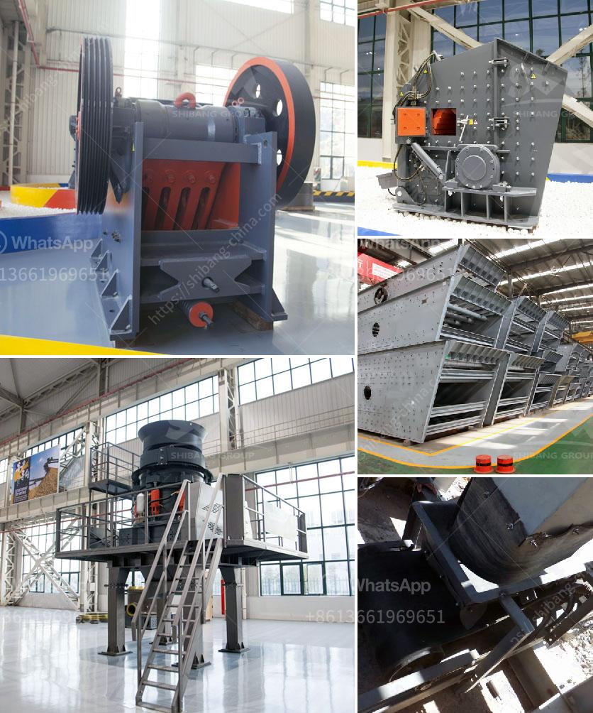

<h3>ultrafine mill grinder</h3>
The mining industry has been evolving since the beginning of civilization. From the extraction of raw materials to the processing and refinement, numerous innovations have revolutionized the industry. One such innovation is the ultrafine mill grinder.

The ultrafine mill grinder is a high-efficiency milling equipment specially designed for processing ores and other materials. It is widely used in industries such as metallurgy, mining, chemical engineering, cement, construction, refractory materials, and ceramics. This grinder can grind various materials with Mohs hardness below 6 and humidity less than 6%, ensuring excellent milling effect and output.

What sets the ultrafine mill grinder apart from traditional mills is its unique design and operational features. Firstly, it employs a multidimensional structure, which helps to reduce the floor space and installation area. This is particularly advantageous for those working with limited space or planning to set up a new milling facility.

Secondly, the ultrafine mill grinder adopts an advanced grinding principle, with a combination of rolling, impacting, and grinding. This ensures thorough and efficient grinding, resulting in a fine and uniform product. The grinder is equipped with a highly sensitive and accurate grading system, which controls the particle size distribution according to the needs of the users.

The advanced grinding principle, along with the precise grading system, makes the ultrafine mill grinder highly efficient in terms of energy consumption. Compared to traditional mills, the energy consumption of the ultrafine mill grinder is significantly lower. This not only reduces the environmental impact but also results in lower operating costs for the users.

Another feature that distinguishes the ultrafine mill grinder is its excellent wear resistance. This is achieved through the use of high-quality materials and advanced manufacturing techniques. The grinding chamber and other components are made of wear-resistant materials, which prolong the service life of the grinder. Additionally, the grinder is equipped with a wear-resistant lining, further enhancing its durability and reducing maintenance requirements.

Furthermore, the ultrafine mill grinder is also equipped with a high-precision and efficient pulse dust collector. This collector effectively removes dust and other impurities, ensuring a clean and healthy working environment. The dust collector system is designed to reduce emissions and meet environmental regulations, making it an eco-friendly option for ore milling.

In conclusion, the ultrafine mill grinder is a game-changer in the field of ore milling. Its unique design, advanced grinding principle, efficient energy consumption, excellent wear resistance, and environmental friendliness make it a preferred choice for many industries. Whether it is grinding metallic ore, non-metallic minerals, or any other material, this grinder ensures high-quality and consistent results. With its innovative features, the ultrafine mill grinder is reshaping the industry standards and setting new benchmarks for ore milling.
<h3>Contact us</h3><ul><li><strong>Whatsapp:&nbsp;<a href="https://wa.me/8613661969651">+8613661969651</a></strong></li><li><a href="https://swt.shibang-china.com/?git&amp;zhl&amp;ultrafine mill grinder"><strong>Online Service(chat now)</strong></a></li></ul><h3>Related</h3><ul><li><a href='equipment needed for small scale mining in zimbabwe.md'>equipment needed for small scale mining in zimbabwe</a></li><li><a href='coal beneficiation.md'>coal beneficiation</a></li><li><a href='crushing plant suppliers in pakistan.md'>crushing plant suppliers in pakistan</a></li><li><a href='ball mill 100tph catalog.md'>ball mill 100tph catalog</a></li><li><a href='crushing and screening costs.md'>crushing and screening costs</a></li></ul>