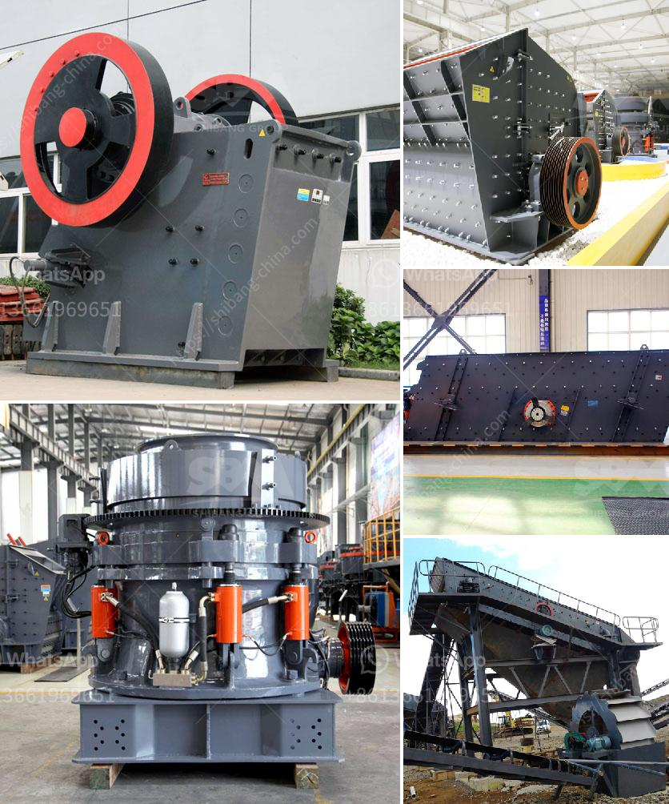

<h3>used aggregate crusher for sale in india</h3>
The demand for aggregates as construction materials has been increasing in India, which is one of the fastest-growing economies in the world. This necessitates the need for high-quality aggregates for building roads, bridges, buildings, and other infrastructure projects. To meet this demand, many construction companies are opting for used aggregate crushers for sale in India.

Aggregate crushers are machines that break down the materials into coarse particles for use in various construction applications. These crushers can be stationary or portable, depending on the specific requirements of the project. They are usually used in combination with screening equipment to separate the desired sizes of aggregates.

One of the advantages of purchasing used aggregate crushers is the cost savings. Used crushers are generally more affordable compared to brand new ones, making them an attractive option for budget-conscious contractors. Additionally, used crushers may still be in good working condition, especially if they have been maintained well by their previous owners.

When considering the purchase of a used aggregate crusher, it is essential to inspect the machine thoroughly. Checking for any damages, wear and tear, and potential mechanical issues can help avoid costly repairs or replacements in the future. Buyers should also consider the specific requirements of their project, such as the desired output capacity and size of the aggregates, before finalizing a purchase.

India offers a wide range of used aggregate crushers for sale, catering to various budget and project requirements. These crushers can be found in different regions and cities, both through online platforms and physical dealerships. Buyers should explore multiple options and compare prices and conditions before making a decision.

In conclusion, the demand for aggregates in India is driving the market for used aggregate crushers. Investing in a used crusher can be a cost-effective solution for construction companies looking to acquire high-quality aggregates at a reasonable price. However, proper inspection and due diligence are necessary to ensure a successful purchase and to maximize the crusher's lifespan and performance.
<h3>Contact us</h3><ul><li><strong>Whatsapp:&nbsp;<a href="https://wa.me/8613661969651">+8613661969651</a></strong></li><li><a href="https://swt.shibang-china.com/?git&amp;zhl&amp;used aggregate crusher for sale in india"><strong>Online Service(chat now)</strong></a></li></ul><h3>Related</h3><ul><li><a href='graphite powder processing equipment.md'>graphite powder processing equipment</a></li><li><a href='hydraulic driven track mobile plant.md'>hydraulic driven track mobile plant</a></li><li><a href='100 tph cobble crushing plant.md'>100 tph cobble crushing plant</a></li><li><a href='quarry stone dressing machine.md'>quarry stone dressing machine</a></li><li><a href='calculation crusher plant cost.md'>calculation crusher plant cost</a></li></ul>